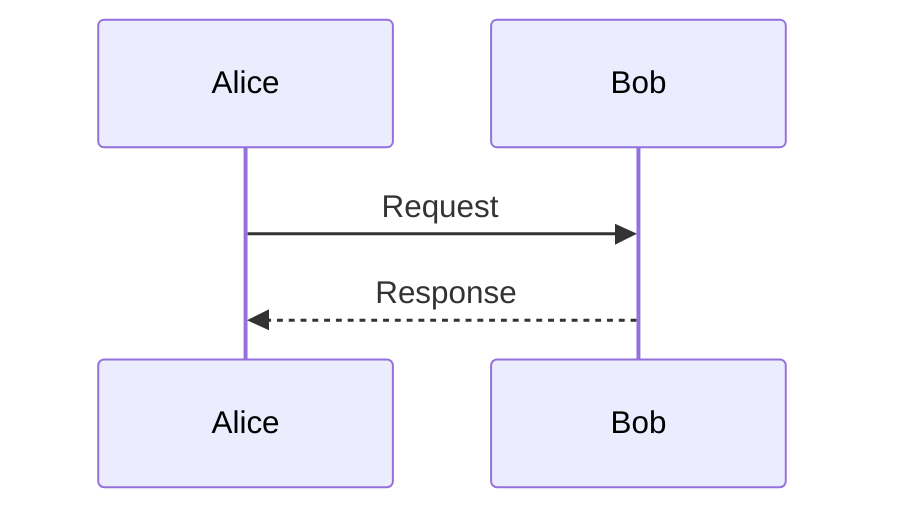

# How to Contribute

This repository contains the technical documentation for the APTITUDE EUDI Wallet pilot.

Most contributions are documentation updates, including requirements, RFC content, clarifications, diagrams, and rulebook material. This is not an application code repository.

## Table of Contents

* [General Principles](#general-principles)
* [Files and Markup Language](#files-and-markup-language)
* [Structure and Style](#structure-and-style)
* [Normative Language](#normative-language)
* [What You Can Contribute](#what-you-can-contribute)
* [Recommended Workflow](#recommended-workflow)
* [If You Want to Preview Locally](#if-you-want-to-preview-locally)
* [Writing Checklist](#writing-checklist)
* [Syntax for Diagrams](#syntax-for-diagrams)
* [Terminology](#terminology)
* [About the `reference/` Folder](#about-the-reference-folder)
* [Pull Request Expectations](#pull-request-expectations)
* [Reviews and Feedback](#reviews-and-feedback)
* [Licensing](#licensing)

## General Principles

* Be clear, concise, and precise.
* Prefer normative and unambiguous language where appropriate.
* Keep changes focused and scoped; avoid mixing unrelated edits in the same pull request.
* When in doubt, follow existing patterns in the repository.

## Files and Markup Language

* All documentation files shall be written in **Markdown**.
* Use GitHub-flavored Markdown features where appropriate.
* Follow [GitHub's official documentation](https://docs.github.com/en/get-started/writing-on-github/getting-started-with-writing-and-formatting-on-github/basic-writing-and-formatting-syntax) for syntax and formatting.

## Structure and Style

* Use clear, hierarchical headings (`#`, `##`, `###`, ...).
* Headings should follow a logical progression without skipping levels.
* Use inline code formatting (`` `code` ``) for parameter names, keywords, and literal values.
* Use bullet lists for enumerations and requirements.
* Start each RFC or specification page with a short summary and a visible status such as `draft`, `accepted`, or `deprecated`.
* Explain assumptions, dependencies, and trade-offs when they are relevant to interpretation or implementation.
* Keep text short, direct, and easy to review.

## Normative Language

To ensure technical precision and interoperability, these specifications adhere to RFC 2119 and RFC 8174 regarding the use of normative language.

Contributors must use the following terms to define the specific requirement levels within the text:

* **SHALL**: This term indicates an absolute requirement.
* **SHALL NOT**: This term indicates an absolute prohibition.
* **SHOULD**: This term indicates that valid reasons may exist in specific circumstances to deviate from a requirement, provided the implications are fully understood and weighed.
* **SHOULD NOT**: This term indicates that a particular behavior may be acceptable or useful in specific cases, though the full implications must be carefully evaluated before implementation.
* **MAY**: This term indicates a truly optional feature. Implementations must maintain interoperability regardless of whether these options are included.

When defining artifact formats in tables, use the following terms in the dedicated requirement column:

* **REQUIRED**: The specified field SHALL be implemented.
* **REQUIRED if**: The specified field SHALL be implemented if the associated condition is met.
* **OPTIONAL**: The specified field MAY be implemented.

To maintain consistency and minimize ambiguity, do not use the following terms. Replace them with their designated normative synonyms:

* Do not use **MUST**. Use **SHALL** instead.
* Do not use **MUST NOT**. Use **SHALL NOT** instead.
* Do not use **RECOMMENDED**. Use **SHOULD** instead.
* Do not use **NOT RECOMMENDED**. Use **SHOULD NOT** instead.

## What You Can Contribute

* Propose a new requirement.
* Improve or clarify an existing RFC or rulebook section.
* Add examples or diagrams that improve understanding.
* Report gaps, unclear wording, or conflicts with rulebooks, schemas, or reference specifications.

## Recommended Workflow

1. Read the relevant context first, including [README.md](README.md), the affected documentation under `docs/`, and supporting materials under `reference/`.
2. Open a GitHub Issue describing what you want to change and why, if the change is substantial or needs discussion.
3. Create a pull request with a focused update, ideally limited to one topic, RFC, or rulebook change.
4. Link the relevant Issue, explain the rationale, and call out any open questions.
5. Address review comments and keep the final diff small and easy to inspect.

## If You Want to Preview Locally

This documentation site is built with MkDocs.

You do not need to run MkDocs locally to suggest or submit documentation changes. A pull request with clear documentation updates is usually sufficient. Local preview is optional and is mainly useful when you want to verify formatting or navigation before review.

### First-Time Setup

1. Create a Python virtual environment:

   ```bash
   python3 -m venv .venv
   ```

2. Activate it:

   ```bash
   source .venv/bin/activate
   ```

3. Install dependencies:

   ```bash
   pip install -r requirements.txt
   ```

### Start the Preview Server

After activation, run:

```bash
mkdocs serve
```

Open `http://127.0.0.1:8000/` in your browser.

The page updates automatically when files change.

Alternative without activation:

```bash
.venv/bin/mkdocs serve
```

### Why the Virtual Environment Matters

* It isolates project dependencies from system Python packages.
* It prevents version conflicts with other projects.
* It helps keep local builds reproducible across contributors and CI/CD.

## Writing Checklist

* Create and edit documentation under `docs/`.
* Use consistent terms across documents.
* Link related RFCs, issues, and supporting references where relevant.
* Put images in `docs/img/` and link them with relative paths.
* Add new pages to `nav:` in `mkdocs.yml` so they appear in the site navigation.
* Check that headings, terminology, and references remain consistent after your edits.

## Syntax for Diagrams

All diagrams must be created using **Mermaid** and embedded directly in Markdown.

* External images should be avoided for diagrams.
* Mermaid code must be included using fenced code blocks with the `mermaid` language identifier.

### Required Syntax

````markdown
```mermaid
Diagram code
```
````

This ensures diagrams are automatically rendered by GitHub.

### Example

Markdown syntax:

````markdown

````

Rendered content:


## Terminology

Use [docs/glossary-definitions.md](docs/glossary-definitions.md) as the authoritative source for terminology and definitions used across this repository.

## About the `reference/` Folder

* Treat `reference/` as read-only source material for rulebooks, schemas, and external specifications.
* Cite the exact source path when deriving requirements or wording from reference material.
* Do not edit files inside `reference/` unless you are explicitly working on a submodule update.

## Pull Request Expectations

* Keep each pull request focused on a single change or closely related set of changes.
* Summarize what changed, why it changed, and which documents are affected.
* Link the relevant Issue, RFC, or discussion when applicable.
* Ensure the documentation builds and renders correctly if your changes affect structure, navigation, or formatting.

## Reviews and Feedback

* Be respectful and constructive when giving feedback.
* Reviews should focus on clarity, correctness, consistency, and traceability.
* Authors are encouraged to iterate on the document based on review comments.

## Licensing

* Contributions are covered by the repository licensing terms unless a specific RFC or imported document states otherwise.
* Some RFCs or referenced materials may have different terms. Preserve existing notices when editing them.
