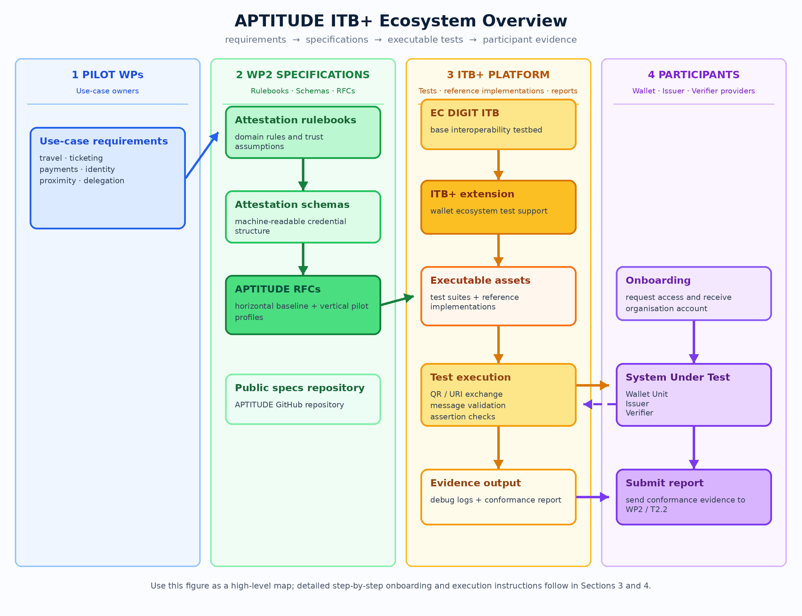
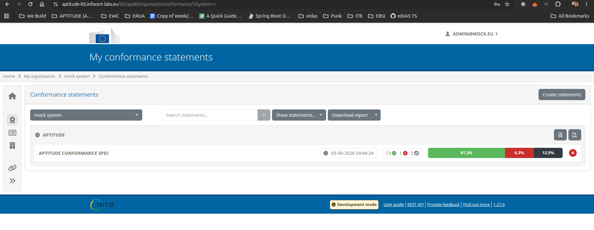
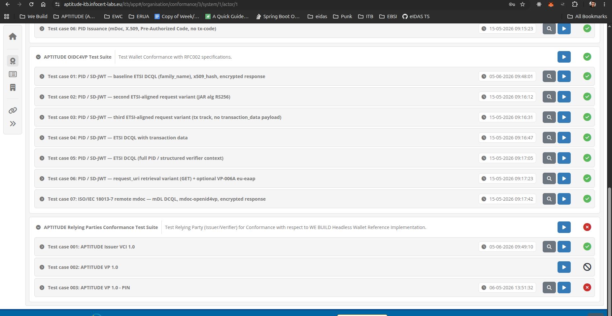
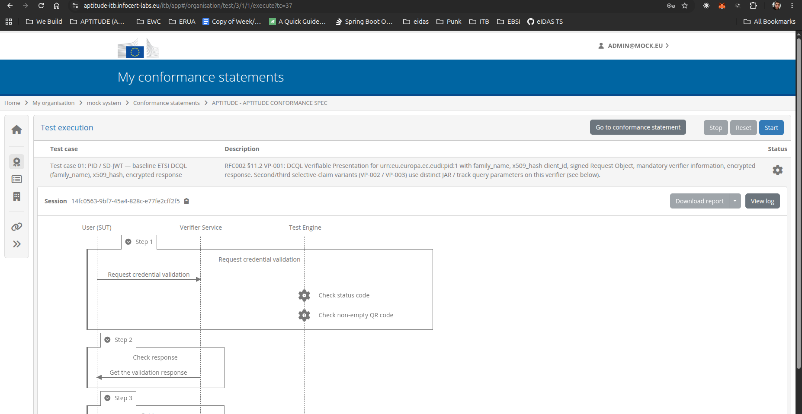
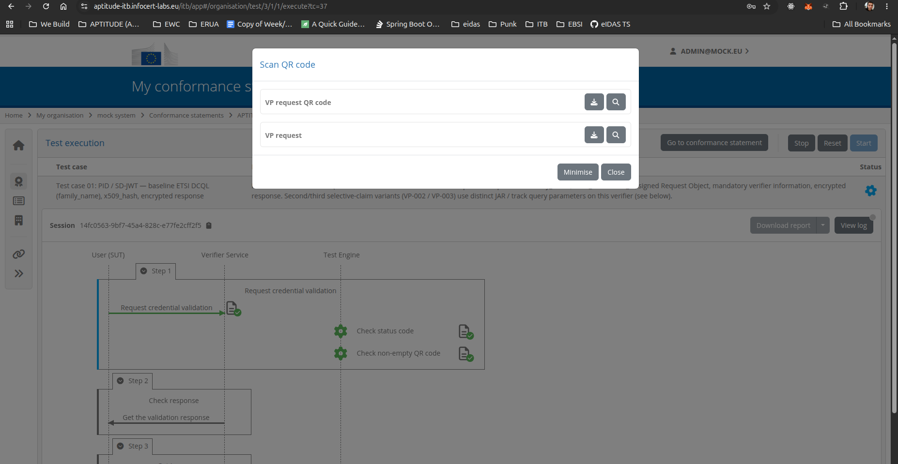
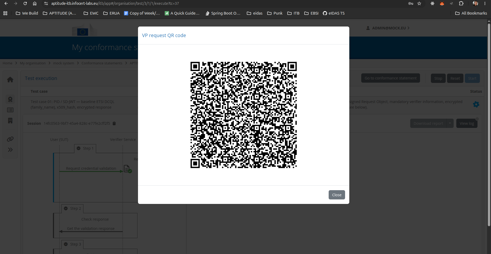
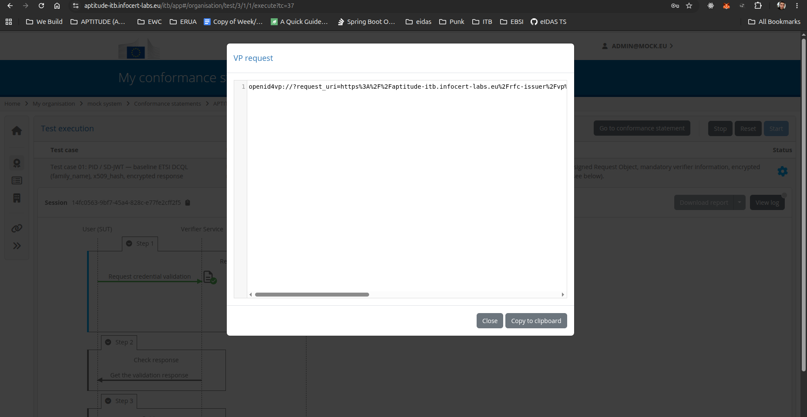
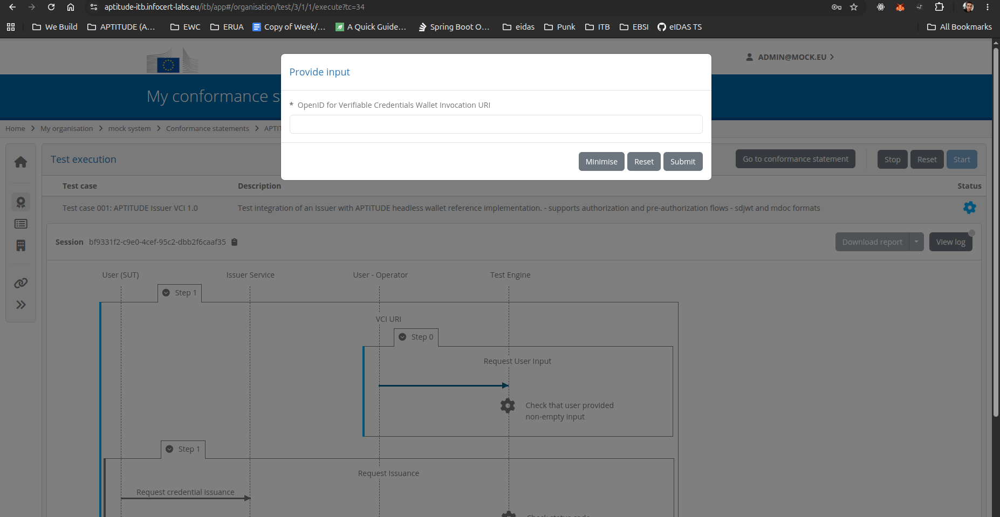
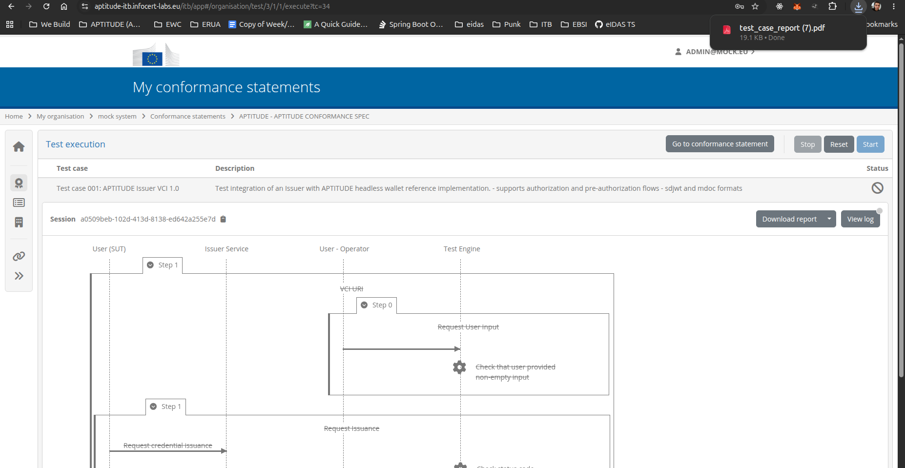
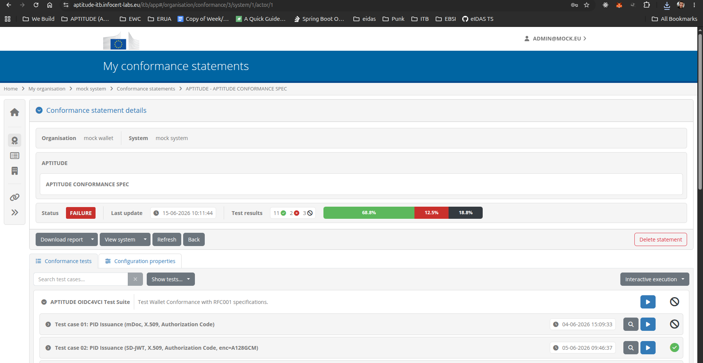

# APTITUDE ITB+ User Onboarding Manual

**APTITUDE WP2 — T2.2: Interoperability test-bed**  
**University of the Aegean — UAegean i4m Lab**  
**Version 1.0 | June 2026**

Authors: Nikos Triantafyllou & Petros Kavassalis, UAegean i4m Lab  
Reviewers: Luca Vallone, IPZS.IT; Giancarlo Degani, INFOCERT

---

## Table of contents

- [1. Purpose and scope of this document](#1-purpose-and-scope-of-this-document)
- [2. Conformance testing and interoperability testing](#2-conformance-testing-and-interoperability-testing)
  - [2.1 What is ITB+?](#21-what-is-itb)
  - [2.2 What is conformance testing?](#22-what-is-conformance-testing)
  - [2.3 What are APTITUDE RFCs?](#23-what-are-aptitude-rfcs)
  - [2.4 How APTITUDE RFCs are defined through Work Packages and Pilot Use Cases](#24-how-aptitude-rfcs-are-defined-through-work-packages-and-pilot-use-cases)
  - [2.5 From RFCs to testable implementations](#25-from-rfcs-to-testable-implementations)
  - [2.6 From ITB+ conformance testing to Playground interoperability testing](#26-from-itb-conformance-testing-to-playground-interoperability-testing)
- [3. Onboarding and using ITB+](#3-onboarding-and-using-itb)
  - [3.1 Requesting onboarding](#31-requesting-onboarding)
  - [3.2 Accessing APTITUDE ITB+](#32-accessing-aptitude-itb)
  - [3.3 Executing the APTITUDE test suite](#33-executing-the-aptitude-test-suite)
  - [3.4 Accessing debug logs](#34-accessing-debug-logs)
  - [3.5 Downloading a report](#35-downloading-a-report)
- [4. Submitting a conformance report to WP2/T2.2](#4-submitting-a-conformance-report-to-wp2t22)

---

## 1. Purpose and scope of this document

The purpose of this document is to provide onboarding instructions for APTITUDE participants that wish to use ITB+ for conformance testing and interoperability-readiness assessment.

The manual explains how an organisation can request access to APTITUDE ITB+, log in to the platform, execute the available APTITUDE test suites, access debug logs, download conformance reports, and submit successful results to the APTITUDE project team.

The manual is intended for organisations testing one or more of the following software solutions or components:

- Wallet Unit
- Issuer
- Verifier

The tests are executed against the relevant [APTITUDE RFCs](https://github.com/APTITUDE-Consortium/aptitude-eudi-wallet-specs/tree/main/docs) and profiles supported by the participant's implementation.

---

## 2. Conformance testing and interoperability testing

### 2.1 What is ITB+?

ITB+ is a platform for conformance self-validation testing against semantic and technical specifications. It is based on, and extends, the European Commission's DIGIT Interoperability Testbed, adding support for wallet ecosystems, profile-based testing, reference implementations, domain-specific test suites, and detailed evidence-based reporting.

ITB+ has been developed as community-oriented testing infrastructure, with the University of the Aegean / UAegean i4m Lab playing a key technical and coordination role in its adaptation, extension, and operation for wallet-related conformance and interoperability testing. In this role, UAegean i4m Lab supports the integration of test suites, reference implementations, and participant onboarding processes, while ITB+ itself remains positioned as neutral, reusable, and extensible community infrastructure.

In the context of APTITUDE, ITB+ provides a shared testing environment where participating organisations can test implementations such as Wallet Units, Issuers, and Verifiers against selected APTITUDE RFCs and profiles. The platform allows participants to execute predefined test cases, inspect debug logs, and download conformance reports that document the observed behaviour of their implementation during test execution.

ITB+ operates by exchanging messages with the System Under Test. Depending on the selected test case, the tested system may be required to process a credential offer, respond to a presentation request, generate a credential issuance flow, or expose a verifier request. ITB+ validates the execution steps against the relevant profile and records the results.

The platform is designed to support different levels of testing, including protocol conformance testing, reference implementation testing, and domain-specific profile testing. This makes it useful not only for checking whether an implementation follows a technical protocol, but also for assessing whether it behaves correctly in a specific ecosystem or application context.

For APTITUDE participants, ITB+ should be understood as a practical onboarding, testing, and reporting environment that helps organisations identify implementation issues early, improve interoperability readiness, and collect evidence before wider pilot, plug-test, or deployment activities.

### 2.2 What is conformance testing?

Conformance testing is the process of evaluating whether a System Under Test (SUT) satisfies the requirements of a selected specification, profile, or test suite. In practical terms, conformance testing checks whether an implementation behaves as expected when it executes a defined technical flow.

For wallet ecosystems, this may include checking whether a Wallet Unit correctly handles a credential offer or presentation request, whether an Issuer generates the expected credential issuance flow, or whether a Verifier creates a valid presentation request and processes the wallet response correctly.

A conformance test suite is composed of executable test cases. Each test case represents a specific scenario and includes a set of expected behaviours or assertions. During execution, ITB+ observes the interaction between the platform, the reference implementation where applicable, and the System Under Test. The result of the test is recorded as evidence and may be reported as successful, failed, or inconclusive, depending on the outcome.

In ITB+, conformance testing can cover three complementary levels:

#### A) Protocol conformance testing

This verifies whether the implementation follows the selected protocol APTITUDE profile. For example, it may check request and response formats, required parameters, security mechanisms, metadata, credential formats, and the correct sequencing of OpenID4VCI, OpenID4VP, HAIP, SD-JWT VC, mdoc, or other profiled interactions, such as WUA structural, protocol, and lifecycle checks.

#### B) Reference implementation testing

This verifies whether the System Under Test can interoperate with a controlled counterpart that implements the expected behaviour of a specific profile. For example, a Wallet Unit may be tested against a reference Issuer or reference Verifier integrated into ITB+.

#### C) Domain-specific profile testing

This verifies whether the implementation satisfies additional constraints required by a specific pilot, domain, or use case. These constraints may include required claims, credential types, trust assumptions, transaction binding, consent handling, signing flows, ticketing flows, or other business-level requirements.

Conformance testing does not automatically prove full legal, regulatory, or production readiness. It also does not guarantee interoperability with every possible implementation in every possible environment. Instead, it provides evidence that a specific implementation has passed a specific test suite for a declared profile, role, and version.

For this reason, ITB+ conformance testing should be seen as an important step toward interoperability readiness. It helps participants identify deviations early, improve their implementations, and prepare for later interoperability events, plug tests, pilot validation, or formal assessment processes.

### 2.3 What are APTITUDE RFCs?

[APTITUDE RFCs](https://github.com/APTITUDE-Consortium/aptitude-eudi-wallet-specs/tree/main/docs) are part of a three-layer documentation structure. Attestation Rulebooks provide the human-readable, domain-level requirements for each credential type. Attestation Schemas provide the machine-readable encoding of those requirements. RFCs translate the technical requirements into testable protocol behaviour. ITB+ test suites are derived from the RFC layer, but rely on Attestation Schemas for credential structure validation.

APTITUDE RFCs should be understood as **opinionated, implementation-oriented profiles of existing standards and specifications**. Rather than redefining the EUDI Wallet architecture, the RFCs select and instantiate the relevant parts of the existing stack, including ARF-aligned requirements, OpenID4VCI, OpenID4VP, HAIP, SD-JWT VC, mdoc, and relevant ETSI profiles, in a way that supports concrete piloting and interoperability testing.

The purpose of the RFCs is to establish a common technical understanding across APTITUDE participants. In practice, this means that the RFCs help to:

- reduce ambiguity in the interpretation of the underlying standards;
- select the options that are relevant for the APTITUDE use cases;
- reduce the implementation scope where full standard coverage is not required for a pilot;
- define common protocol, trust, credential, and presentation expectations;
- translate pilot and rulebook requirements into testable technical behaviour; and
- provide the basis for ITB+ test suites and test cases.

The first APTITUDE RFCs are organised as horizontal RFCs. These define baseline, cross-pilot requirements for common wallet-facing functions such as credential issuance and presentation. Additional vertical RFCs may be added when specific work packages or pilot use cases introduce domain-specific requirements.

The APTITUDE RFCs are maintained publicly in the [APTITUDE GitHub repository](https://github.com/APTITUDE-Consortium/aptitude-eudi-wallet-specs/tree/main/docs), under the project's technical specification documentation.

### 2.4 How APTITUDE RFCs are defined through Work Packages and Pilot Use Cases

APTITUDE RFCs are not written in isolation. They are derived from the needs of the APTITUDE pilot work packages and are used to translate pilot requirements into a common technical basis for implementation and testing.

The process can be understood as a chain from pilot needs to executable testing:

1. **Pilot use-case requirements**  
   The piloting work packages define the use cases they need to implement. These may involve travel, ticketing, check-in, payment, mobile vehicle registration certificates, business flows, or other wallet-enabled scenarios.

2. **Functional and rulebook requirements**  
   The use-case requirements are analysed and expressed as functional, operational, and trust-related requirements. Where needed, this includes attestation rulebooks, trust framework requirements, credential requirements, presentation requirements, and domain-specific constraints.

3. **WP2 technical analysis**  
   WP2 analyses these requirements and maps them to the relevant EUDI Wallet standards, ARF-aligned assumptions, ETSI profiles, and protocol options. This step identifies what needs to be common across pilots and what is specific to a given domain or work package.

4. **RFC definition**  
   The mapped requirements are formalised as APTITUDE RFCs. Horizontal RFCs define the baseline shared across pilots, while vertical RFCs capture additional domain-specific or use-case-specific requirements.

### 2.5 From RFCs to testable implementations

1. **Implementation by technology providers**  
   Once the use cases and RFCs are defined, the relevant Technology Providers implement the required software components. These may include Wallet Units, Issuers, Verifiers, relying party services, trust infrastructure components, or domain-specific service components. In some cases, the technology provider is also the use-case owner.

2. **ITB+ conformance testing**  
   The implemented software components are then tested through ITB+ against the relevant RFCs and profiles. The goal is to verify that the components implement the agreed technical behaviour and can participate in the APTITUDE pilot flows in a repeatable and evidence-based way.

This process ensures that pilot requirements are progressively transformed into technical requirements, technical requirements into RFCs, and RFCs into executable ITB+ test suites.

### 2.6 From ITB+ conformance testing to Playground interoperability testing

Once pilot use cases have been defined and the relevant RFCs have been produced, the **use cases are implemented by the participating technology providers and use-case owners**. These implementations are **concrete software components**, such as **Wallet Units**, **Issuers**, **Verifiers**, relying party services, or domain-specific pilot applications.

**ITB+ focuses on the conformance and interoperability readiness of these software components**: Wallet Units, Issuers, and Verifiers. It checks whether a component behaves according to the selected APTITUDE RFC, profile, role, and version. The purpose is to provide an evidence-based result showing that the component passed a specific test suite under controlled and repeatable conditions.

This makes ITB+ an important preparation step before broader interoperability testing. By first running conformance tests in ITB+, participants can identify implementation issues early, align their behaviour with the agreed APTITUDE RFCs, and reduce the risk of failures when interacting with other real-world implementations.

After ITB+ conformance testing, participants may proceed to interoperability testing in the [Playground environment](https://playground.france-identite.gouv.fr/). In this next stage, implementations are tested against other deployed wallets, issuers, verifiers, and relying party interfaces. This complements ITB+ testing by exercising real interactions across independently developed components.

In the APTITUDE testing approach, the two stages should be seen as complementary:

- **ITB+ conformance testing** verifies behaviour against a declared RFC, profile, test suite, and reference implementation where applicable.
- **Playground interoperability testing** verifies practical interaction with other deployed implementations in a shared testing environment.

A successful ITB+ report therefore does not replace interoperability testing. Instead, it provides a technical readiness baseline that helps participants enter playground testing with greater confidence and clearer evidence about their implementation.

---

## 3. Onboarding and using ITB+

### 3.1 Requesting onboarding

To request onboarding to APTITUDE ITB+, please contact the ITB+ maintainers or the WP2 leads.

Requests may be submitted through one of the following channels:

1. Email to the ITB+ maintainers: `triantafyllou.ni@aegean.gr`
2. Email to the WP2 leads
3. APTITUDE Slack support channel: `#itb-support`

When submitting the request, please include the following information:

| Information | Description |
|---|---|
| Organisation name | The legal or project name of the participating organisation. |
| Technical contacts | Names and email addresses of the people who will execute or support the tests. |
| Component role(s) | Issuer, Verifier, Wallet Unit, or a combination of these. |
| Targeted profiles / RFCs | The APTITUDE RFCs or profiles supported by the implementation. |
| Preferred communication channel | Email or Slack contact for follow-up. |

After the request has been reviewed, an organisation account will be created and the relevant credentials will be shared with the nominated technical contacts.

### 3.2 Accessing APTITUDE ITB+

To access APTITUDE ITB+, open the following URL in your browser:

<https://aptitude-itb.infocert-labs.eu/itb/>

Log in using the credentials provided during onboarding.

After logging in, navigate to **My Conformance Statements** by selecting the ribbon icon from the left-hand navigation menu.

### 3.3 Executing the APTITUDE test suite

From the My Conformance Statements page, select the **APTITUDE Conformance Test Suite**. The available test cases are displayed under the selected test suite.

To execute a test case:

1. Select the relevant test case.
2. Click the play button next to the test case.
3. Review the test execution page.
4. Click **Start** to begin the test execution.

Depending on the type of component being tested, ITB+ will present a different interaction flow.

After selecting the test case, click the **Start** button.

#### Wallet Unit testing

For Wallet Unit testing, ITB+ presents a QR code and a URI containing either:

- a credential offer, for issuance tests; or
- a presentation request, for verification or presentation tests.

The Wallet Unit should scan the QR code or open the URI and complete the requested interaction.

#### Issuer and Verifier testing

For Issuer and Verifier testing, ITB+ may present an input field where the participant provides a credential-offer URI, presentation request URI, or service endpoint generated by their own implementation, depending on the selected test case.

After the required information has been provided and the prompt is closed, ITB+ will continue the test execution and evaluate the interaction against the selected APTITUDE test case.

In all cases, after closing the prompts and interacting with them as required, ITB+ initiates the test execution.

### 3.4 Accessing debug logs

During test execution, debug logs can be accessed by clicking the **View Logs** button.

The logs provide technical details about the messages exchanged during the test execution and can be used to identify the reason for a failed or incomplete test.

The same debug information is also included in the generated test report, allowing participants and reviewers to inspect the execution after the test has completed.

### 3.5 Downloading a report

Once a test has completed, a conformance report can be downloaded by clicking the **Download Report** button from the test execution page.

The report contains the result of the executed test case, including the execution status, validation steps, and debug logs.

To download a report covering all tests executed by your organisation, navigate back to the APTITUDE Conformance Test Suite view and click **Download Report** from the conformance statement page.

---

## 4. Submitting a conformance report to WP2/T2.2

To demonstrate conformance to the relevant APTITUDE RFCs, participants should submit the successful conformance statement report to the APTITUDE project team.

The report may be submitted through one of the following channels:

- Email to the WP2 leads
- APTITUDE Slack support channel: `#itb-support`

When submitting the report, please include:

- Organisation name
- Tested component role: Issuer, Verifier, Wallet Unit, or combination
- Targeted APTITUDE RFCs / profiles
- Date of test execution
- The downloaded conformance statement report
- Any relevant comments, limitations, or known issues
