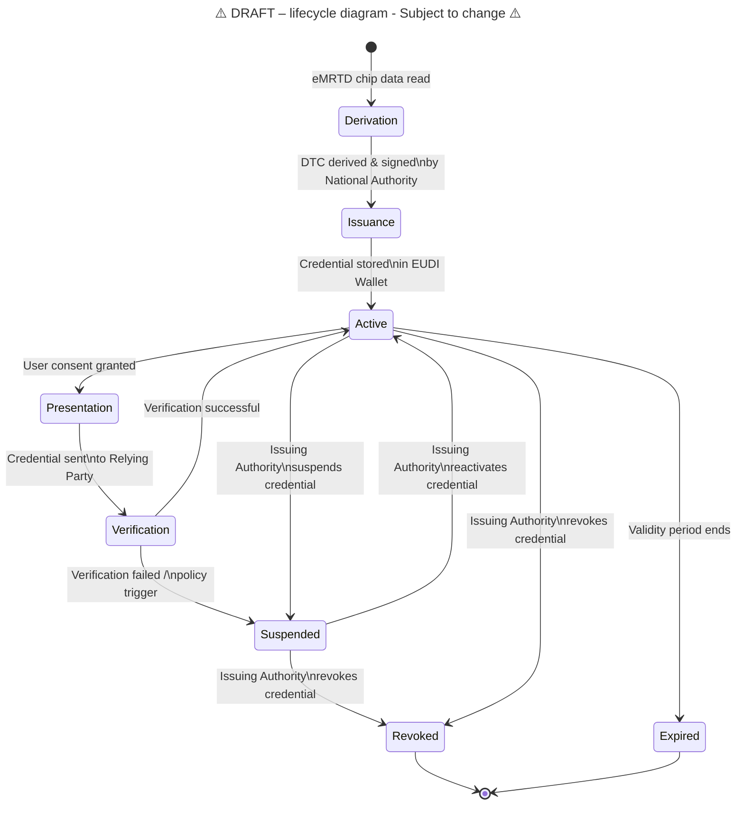
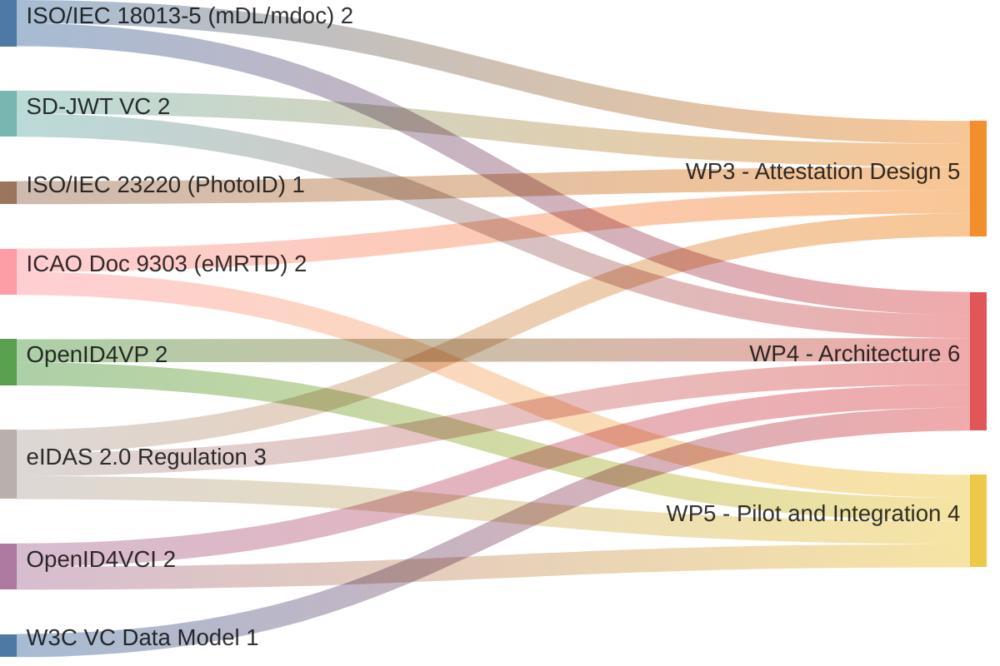

| Version | Date | Description |
|---------|------------|------------|
| 0.1 | 11-02-2026 | First draft version - Filled par 1.1 |

# APTITUDE - *Digital Travel Credential (DTC) rulebook*

* Author(s):
    * ...
    * ...

## 1 Introduction
### 1.1 Document scope and purpose

This Attestation Rulebook defines the Digital Travel Credential (DTC) as an electronic attestation of attributes for the EUDI Wallet ecosystem. The DTC enables travellers to store and present identity and travel authorization data in their Wallet Unit for border control and travel-related use cases.

The primary objective of the DTC is to facilitate secure and privacy-preserving identity verification and travel document validation at border crossing points and during travel. The DTC is designed to complement existing physical travel documents (e.g. passports, visas) by providing a digital equivalent that supports selective disclosure, offline presentation and strong cryptographic verification.

Within the Aptitude context, the target model is the ICAO DTC Type 2, bound to a physical eMRTD and derived using mechanisms aligned with European regulations and ICAO guidelines.

This rulebook specifies:

* The attributes and metadata that comprise a DTC attestation
* The encoding formats that SHALL be supported for DTC attestations.
* The issuance, presentation and verification requirements for DTC attestations within the EUDI Wallet framework.
* The trust anchor mechanisms, revocation procedures and compliance requirements that apply to DTC attestations.

### 1.2 Document structure
### 1.3 Key words
This document uses the capitalised keywords 'SHALL', 'SHOULD' and 'MAY' as specified in [RFC 2119], i.e. to indicate requirements, recommendations and options specified in this document.
### 1.4 Terminology
Terminologies and definitions within Aptitude project are listed in [APTITUDE Glossary](../glossary.md)

## 2 Attestation attributes and metadata
### Chapter overview and requirements
This section defines the functional and semantic scope of the data composing the APTITUDE Digital Travel Credential (DTC), based on the evidence collected during the stock‑taking phase.

The cross‑border value of a DTC critically depends on preserving full alignment with the ICAO data model while at the same time allowing extensions required for integration within the EUDI Wallet ecosystem and the eIDAS 2.0 framework.

#### Data model
International interoperability and backward compatibility with existing border‑control infrastructure remain core requirements for any realistic DTC deployment.

This section defines which data sets must be present and preserved.
| Index | Requirement specification |
| --- | --- |
| DTC_DM_01 | The APTITUDE DTC SHALL contain DG1, DG2, SOD as from the physical eMRTD passport |
| DTC_DM_02 | The APTITUDE DTC SHALL contain fields like: dtcSecurityInfo, DTCIdentifier, DTCDOE, and a signature structure for validation |
| DTC_DM_03 | The APTITUDE DTC SHALL be encapsulated as a Verifiable Credential (VC), ensuring compatibility with the EUDI Wallet data formats (SD-JWT or MDOC-CBOR). |
| DTC_DM_04 | The APTITUDE DTC SHALL include a cryptographic binding between the Virtual Component (VC) and the Physical Component (PC) stored in the WSCD. |
| DTC_DM_05 | APTITUDE DTC MAY contain additional attributes beyond the derived eMRTD dataset |
| DTC_DM_06 | The data model SHALL support Selective Disclosure, allowing the traveller to share only the strictly necessary attributes (e.g., only DG2 for biometric match) with Relying Parties. |

### Attributes

#TODO: involve T2.1.2 and WP3

#TODO: should we specify the source that requires an attribute? i.e. DTC or ICAO or EUDI?

| **Data Identifier** | **Definition**          | **Data type**     | **Example value** |
|---------------------|-------------------------|-------------------|-------------------|
| *Provide a value*   | *Provide succinct text* | *Provide a value* | *Provide a value* |

### Optional attributes

| **Data Identifier** | **Definition**          | **Data type**     | **Example value** |
|---------------------|-------------------------|-------------------|-------------------|
| *Provide a value*   | *Provide succinct text* | *Provide a value* | *Provide a value* |

### Conditional attributes

| **Data Identifier** | **Definition**          | **Data type**     | **Example value** |
|---------------------|-------------------------|-------------------|-------------------|
| *Provide a value*   | *Provide succinct text* | *Provide a value* | *Provide a value* |

### Mandatory metadata 

| **Data Identifier** | **Definition**          | **Data type**     | **Example value** |
|---------------------|-------------------------|-------------------|-------------------|
| *Provide a value*   | *Provide succinct text* | *Provide a value* | *Provide a value* |

### Optional metadata 

| **Data Identifier** | **Definition**          | **Data type**     | **Example value** |
|---------------------|-------------------------|-------------------|-------------------|
| *Provide a value*   | *Provide succinct text* | *Provide a value* | *Provide a value* |

### Conditional metadata 

| **Data Identifier** | **Definition**          | **Data type**     | **Example value** |
|---------------------|-------------------------|-------------------|-------------------|
| *Provide a value*   | *Provide succinct text* | *Provide a value* | *Provide a value* |

## 3 Attestation encoding
### Chapter overview and requirements
This chapter defines the encoding‑related requirements for the APTITUDE Digital Travel Credential (DTC) and establishes the technical constraints that any concrete encoding solution must satisfy.

The objective of this chapter is not to mandate a single encoding format, but to specify what properties the encoding must preserve, which standards must be supported and which interoperability conditions must be met for the DTC to function both as:

- an ICAO‑aligned Digital Travel Credential suitable for border‑control use cases, and
- an eIDAS‑compliant attestation that can be stored, managed, and presented within the EUDI Wallet ecosystem.

| Index | Requirement specification |
| --- | --- | 
| DTC_AE_01 | APTITUDE DTC SHALL support SD‑JWT VC encoding | 
| DTC_AE_02 | APTITUDE DTC SHALL ISO/IEC 18013‑5 mdoc-cbor encoding for proximity presentation and interaction with EUDI Wallet readers. | 
| DTC_AE_03 | APTITUDE DTC SHALL implement an encoding approach that addresses the incompatibility between ARF selective disclosure and ICAO LDS integrity‑bound |
| DTC_AE_04 | APTITUDE DTC SHALL encode the photoID profile as per ISO/IEC 23220-4 | 
| DTC_AE_05 | APTITUDE DTC SHALL preserve the ICAO LDS semantics | 
| DTC_AE_06 | APTITUDE DTC SHALL adopt open, standard-based credential encodings to maximize interoperability and avoid vendor lock-in | 
| DTC_AE_07 | The encoding SHALL support a dual-signature or hybrid structure to allow validation via both ICAO CSCA/DS (passive authentication according to Doc 9303 part 11) and eIDAS Trusted Lists. |
| DTC_AE_08 | The encoding SHOULD ensure that the cryptographic link (binding) between the VC and the EUDI Wallet device is preserved across different encoding formats. |

#TODO: Rewrite the following paragraphs

## 3.1 ISO/IEC 18013-5-compliant encoding 
*If the attestation type supports the format specified in ISO/IEC 18013-5,
then in this section the ISO/IEC 18013-5-compliant encoding of attributes and metadata 
should be defined.* 

*It is noted that (see ARB_02 in [Topic 12]) the Schema Provider SHALL analyse whether it must 
be possible for a User to present that type of attestation when the Wallet Unit 
and the Relying Party are in proximity and attestations are presented without 
using the internet. If so,the attestations must be issued in the ISO/IEC 18013-5-compliant 
mdoc format.*

*Furthermore, in this section a document type SHALL be defined, which SHALL be 
unique within the scope of the EUDI Wallet ecosystem (see ARB_05 in [Topic 12]).*

[RULEBOOK AUTHOR TO DEFINE THE ATTESTATION TYPE]

*Provide a list of available encoding formats and their specifications (e.g. encoding, maximum lengths, 
date formats, etc.). For example:*

- tstr, uint, bstr, bool and tdate are CDDL representation types defined in
  [RFC 8610].
    - Regarding type tstr: this document confirms that, as specified in [RFC
    8949], a tstr SHALL be encoded in UTF-8 and SHALL support the full Unicode
    range.
    - All attributes having encoding type tstr SHALL have a maximum length of
    150 characters.
    - This document specifies full-date as full-date = #6.1004(tstr), where tag
    1004 is specified in [RFC 8943].
    - In accordance with [RFC 8949], section 3.4.1, a tdate attribute SHALL
    contain a date-time string as specified in [RFC 3339]. In accordance with
    [RFC 8943], a full-date attribute SHALL contain a full-date string as
    specified in [RFC 3339].
    - The following requirements apply to the representation of dates in
    attributes, unless otherwise indicated:
        - Fractions of seconds SHALL NOT be used;
        - A local offset from UTC SHALL NOT be used; the time-offset defined in
        [RFC 3339] SHALL be to "Z".
    - [RFC 8949], section 4.2, describes four rules for canonical CBOR. Three of
    those rules SHALL be implemented for all CBOR structures, as
    follows:
        - integers (major types 0 and 1) SHALL be as small as possible;
        - the expression of the length in a bstr, tstr, array or map SHALL be as
        short as possible;
        - indefinite-length items SHALL be made into definite-length items.

*This section should include a table the data identifier specified in
Chapter 2, the corresponding attribute identifier to be used in
presentation requests and responses according to [ISO/IEC 18013-5] and the encoding 
of each attribute.*

*Additionally, the following rules should be followed:*

* When specifying new attributes, existing conventions 
for attribute identifier values and attribute syntaxes SHOULD
be considered (see ARB_07 in [Topic 12]).
* Each attribute SHALL be defined within an attribute namespace. 
  * An attribute namespace 
SHALL fully define the identifier, the syntax, and the semantics of each attribute 
within that namespace. 
  * An attribute namespace SHALL have an identifier that is 
unique within the scope of the EUDI Wallet ecosystem, and each attribute 
identifier SHALL be unique within that namespace (see ARB_06a in [Topic 12]) 
  * A domestic namespace MAY be defined 
to specify attributes that are specific to this Rulebook and are not included in 
the applicable EU-wide or sectoral namespace (see ARB_10 in [Topic 12]). 

| **Data Identifier** | **Attribute identifier** | **Encoding format** | **Namespace**|
|------------------------|--------------|------------------|------------------|
| family_name | family_name | tstr | com.example.att.1|

*The corresponding entry for the "attestation_legal_category" attribute defined
in Section 2.1 SHALL be:*

| **Data Identifier** | **Attribute identifier** | **Encoding format** |**Namespace**|
|------------------------|--------------|------------------|------------------|
| attestation_legal_category | attestation_legal_category | tstr |com.example.att.1|

Finally, illustrative examples SHALL be included. 

[RULEBOOK AUTHOR TO PROVIDE AN EXAMPLE OF FULL OR PARTIAL mDOC OF THE ATTESTATION]

[RULEBOOK AUTHOR TO PROVIDE THE ATTRIBUTES AND THEIR VALUES INCLUDED IN THE EXAMPLE]

### 3.2 SD-JWT VC-based encoding 
*If the attestation type supports the format specified in "SD-JWT-based Verifiable 
Credentials (SD-JWT VC)", then in this section the SD-JWT VC-compliant encoding 
of attributes and metadata SHALL be defined. It SHALL be ensured that the attestations 
comply with the 'SD-JWT VCs' profile specified in [HAIP] (see ARB_01b in [Topic 12]).*

*It is noted that a Schema Provider MAY specify in the Attestation 
Rulebook that that type of attestation must be issued in the [SD-JWT VC]-compliant 
format, provided the [SD-JWT VC] specification has been approved by an EU standardisation 
body or by the European Digital Identity Cooperation Group established pursuant to 
Article 46e(1) of the [European Digital Identity Regulation] (see ARB_03 in [Topic 12]).*

*In this section, a Verifiable Credential Type (`vct`) SHALL be defined,
which SHALL be unique within the scope of the EUDI Wallet ecosystem (see ARB_05 in [Topic 12]).*

[RULEBOOK AUTHOR TO DEFINE THE ATTESTATION TYPE]

*Additionally, when specifying new attributes, existing conventions 
for attribute identifier values and attribute syntaxes SHOULD
be considered (see ARB_07 in [Topic 12]).*

*Rulebook authors SHALL ensure that each claim name is either 
- included in the IANA registry for JWT claims,
- is a Public Name as defined in [RFC 7519], or
- or is a Private Name specific to the attestation type. (see ARB_06b in [Topic 12]).*

*For all claims (i.e. all top-level properties, all nested properties, and all array entries), 
the Rulebook SHALL specify whether an Attestation Provider MUST, MAY, or MUST NOT make that
claim selectively disclosable (see ARB_30 in [Topic 12]).*

*Rulebook authors SHOULD consider defining a Type Metadata Document for the attestation type 
specified in the Rulebook, as defined in Chapter 6 of [SD-JWT VC]. If such a document is defined,
it SHOULD contain the Claim Selective Disclosure Metadata (defined in Section 9.3 of [SD-JWT VC]) 
for each of the claims, in order to specify if that claim is selectively disclosable (see ARB_31 
in [Topic 12]).*

*Rulebook authors SHOULD consider defining a JSON Schema for the attestation type specified
in the Rulebook, as defined in Section 6.5 of [SD-JWT VC], and include or reference that 
Schema in the Type Metadata Document meant in ARB_31 (see ARB_32 in [Topic 12]).*

*IANA-registered claims should be presented in a table that
includes their data identifier, attribute identifier, 
encoding format, and reference or note. For example,*

| **Data Identifier** | **Attribute identifier** | **Encoding format** |**Reference/Notes** |**Disclosable**|
|-------------------- |--------------------------|---------------------|--------------------|---------------|
| family_name | family_name | string | Section 5.1 of [OIDC] | MUST |

*A similar table should be used for Public Names and for Private Names specific
to the attestation type defined in this document. For
example:*

| **Data Identifier** | **Attribute identifier** | **Encoding format** | **Notes** |**Disclosable**|
|---------------------|--------------------------|---------------------|-----------|---------------|
| trust_anchor | trust_anchor | string | The trust anchor defined in Section 5 | MUST NOT |

*The corresponding entry for the "attestation_legal_category" attribute defined
in Section 2.1 SHALL be:*

| **Data Identifier** | **Attribute identifier** | **Encoding format** | **Notes** |**Disclosable**|
|---------------------|--------------------------|---------------------|-----------|---------------|
| attestation_legal_category | attestation_legal_category | string | Defined in Attestation Rulebook template |MUST NOT|

Finally, illustrative examples SHALL be included. 

[RULEBOOK AUTHOR TO PROVIDE AN EXAMPLE OF THE JWT CLAIM SET USED BY THE PROVIDER]

[RULEBOOK AUTHOR TO PROVIDE AN EXAMPLE OF THE ISSUED SD-JWT (IN base64 ENCODING)]

[RULEBOOK AUTHOR TO PROVIDE AN EXAMPLE OF A HUMAN READABLE VERSION OF THE SD-JWT PAYLOAD
AND A DESCRIPTION OF THE DISCLOSURES INCLUDED IN THE EXAMPLE]

### 3.3 W3C Verifiable Credentials Data Model-based encoding
*If the attestation type supports the format specified in W3C Verifiable Credentials 
Data Model, then in this section the corresponding encoding of attributes and 
metadata should be defined.* 

*It is noted that only a a non-qualified EAA can use this format (see ARB_01a in [Topic 12])*

*Tables similar to the ones specified in section 4 SHALL be defined.*

*This section SHALL reference one or more documents specifying in detail how a 
Relying Party can request attributes from a such an attestation, and how a User 
can selectively disclose attributes from such an attestation. Moreover, these 
referenced documents SHALL be approved by an EU standardisation body or by the European 
Digital Identity Cooperation Group established pursuant to Article 46e(1) of the 
[European Digital Identity Regulation] (see ARB_04 in [Topic 12]).*

*Finally, illustrative examples SHALL be included.*

[RULEBOOK AUTHOR TO PROVIDE HUMAN READABLE EXAMPLE OF THE ISSUED ATTESTATION]

[RULEBOOK AUTHOR TO PROVIDE AN EXAMPLE OF THE PROOF TYPE]

## 4 Attestation usage
### Chapter overview and requirements
This section defines functional usage requirements and implementation profiles for the DTC lifecycle including issuance, presentation, and verification.

#### Issuance
The rationale around the issuance profile states that the national passport issuing authority remains the sole legitimate entity for issuing and signing a DTC derived from an eMRTD.
| Index | Requirement specification |
| --- | --- |
| DTC_IS_01 | The APTITUDE DTC SHALL be issued exclusively by the National Passport Issuing Authority of the Member State that issued the physical eMRTD. |
| DTC_IS_02 | APTITUDE DTC SHALL be derived from eMRTD chip data (Logical Data Structure - LDS) ensuring a cryptographic link to the physical travel document. |
| DTC_IS_03 | APTITUDE DTC SHALL be derived both from newly issued and already issued eMRTDs. | 
| DTC_IS_04 | The issuance process SHALL result in an ICAO DTC Type 2 (eMRTD-PC bound), where the virtual component is cryptographically linked to a physical secure element within the EUDI Wallet. |
| DTC_IS_05 | APTITUDE DTC SHALL be digitally signed by the national issuing authority acting as a Trusted Attestation Provider within the eIDAS2 framework. |

#### Presentation
| Index | Requirement specification |
| --- | --- |
| DTC_PR_01 | APTITUDE DTC SHALL support remote usage where the attestation can be transmitted in advance for identity validation and risk assessment |
| DTC_PR_02 | APTITUDE DTC SHALL support proximity presentation at border control using border authority proximity control systems (e-gates, desktop equipment, mobile devices) |
| DTC_PR_03 | APTITUDE DTC SHALL ensure explicit user consent in the wallet-based presentation flow |
| DTC_PR_04 | APTITUDE DTC SHALL support selective disclosure / data minimisation |
| DTC_PR_05 | APTITUDE DTC SHALL support an approach that accounts for the reported protocol gap between ISO/IEC 18013‑5 (wallet proximity) and ISO/IEC 14443/APDU (border inspection backwards compatibility) |
| DTC_PR_06 | The presentation flow SHALL support Chip Authentication (CA) mechanisms to prevent cloning and ensure the DTC is bound to the Wallet instance. |
| DTC_PR_07 | APTITUDE DTC SHOULD be presented offline (e.g., via NFC or QR code) in scenarios with limited or no connectivity at the border crossing point. |
| DTC_PR_08 | The presentation SHOULD enable the Relying Party to verify the DTC's validity against both the ICAO PKD/CSCA and the eIDAS Trusted Lists (TL). |
| DTC_PR_09 | The presentation mechanism SHALL support the OpenID4VP (OpenID for Verifiable Presentations) protocol for remote/online interactions. |

#### Verification
| Index | Requirement specification |
| --- | --- |
| DTC_VR_01 | APTITUDE DTC SHALL support cryptographic integrity verification |
| DTC_VR_02 | The verification process SHALL support Passive Authentication (PA) to ensure that the Data Groups (DG1, DG2, etc.) have not been tampered with since issuance. |
| DTC_VR_03 | The verification SHALL support Chip Authentication to check that the DTC resides on the original secure device and has not been cloned. |
| DTC_VR_04 | The verifier SHALL be able to validate the credential using multiple trust anchors: ICAO PKD (Public Key Directory) for travel data and eIDAS Trusted Lists for Wallet attestations. |
| DTC_VR_05 | The verification process SHALL support revocation checking in real-time ...(To be specified). |
| DTC_VR_06 | The verifier SHALL support the verification of Selective Disclosure presentations (e.g., verifying a subset of attributes via SD-JWT) without compromising data authenticity. |
| DTC_VR_07 | The system SHALL support cross-border interoperability, allowing border authorities of one Member State to verify a DTC issued by another Member State's authority. |
| DTC_VR_08 | The verification SHALL include a biometric match (1:1) between the traveller and the DG2 (Face Image) contained within the verified DTC. |

## 5 Trust anchors
### Chapter overview and requirements
| Index | Requirement specification |
| --- | --- |
| DTC_TA_01 | APTITUDE DTC SHALL support an inspection system can verify it using the existing MRTD PKI infrastructure (CSCA/DS model) |
| DTC_TA_02 | APTITUDE DTC SHALL shall enforce (or be configurable to enforce) the principle that the CSCA issuing APTITUDE DTC Signer certificates is the same CSCA that issues Document Signer certificates for the underlying eMRTD |
| DTC_TA_03 | APTITUDE DTC SHOULD support the same level of security as the eMRTD (maybe not needeed here...)|
| DTC_TA_04 | APTITUDE DTC SHALL support reliance on EU-style governance artefacts needed for attestations, specifically: a trusted list of DTC issuers, an attestation catalogue, and rules for registering relying parties |
| DTC_TA_05 | APTITUDE DTC SHALL support a design that acknowledges and manages the structural divergence between ICAO trust anchors (CSCA/DS certificates / PKD) and eIDAS trust anchors (QEAA/Pub‑EAA within EUDIW) |
| DTC_TA_06 | APTITUDE DTC SHALL support a bridging approach/layer to enable interoperability when the attestation is not directly verifiable by non-EU inspection systems relying on existing PKI |
| DTC_TA_07 | APTITUDE DTC SHALL not assume a trust model where the DTC must be issued as QEAA in a way that makes the issuer a QTSP instead of the passport authority, because the report flags this as contradicting ICAO principles requiring the Travel Document Issuing Authority to sign DTC data |
| DTC_TA_08 | APTITUDE DTC SHALL support an option where the DTC is stored/handled as a Pub‑EAA to preserve issuer sovereignty |
| DTC_TA_09 | APTITUDE DTC SHALL allow the applicable attestation trust type (e.g., QEAA vs Pub‑EAA) to be policy/configuration-driven |
| DTC_TA_10 | APTITUDE DTC MAY be able to accommodate alternative/extra signing arrangements (e.g., a possible EU model where DTCs may need to be re-signed by eu‑LISA) |

## 6 Revocation
### Chapter overview and requirements
| Index | Requirement specification |
| --- | --- |
| DTC_RV_01 | APTITUDE DTC SHALL support a full DTC lifecycle covering issuance, verification, and revocation |
| DTC_RV_02 | APTITUDE DTC SHALL support mechanisms for revocation and status checking |
| DTC_RV_03 | APTITUDE DTC SHALL support alignment between EUDI Wallet attestation lifecycle and ICAO DTC lifecycle requirements |
| DTC_RV_04 | The Verifier (Relying Party) SHOULD be able to perform offline status verification if required by the specific border control use case, using periodically updated revocation lists. |

## 7 Compliance
### Chapter overview and requirements

#TODO: involve WP7 

| Index | Requirement specification |
| --- | --- |
| DTC_CM_01 | APTITUDE DTC SHALL support privacy-by-design expectations |

## 8 References

#TODO: copy from D3.1

| **Item Reference** | **Standard name/details** |
| [RFC 2119] | Key words for use in RFCs |
| --- | --- |
| ... | ...|
| ... | ... |

### standards 

#TODO: how to provide an overview of standards and use cases? 

| name | description | WP3 | WP4 | WP5 | 

