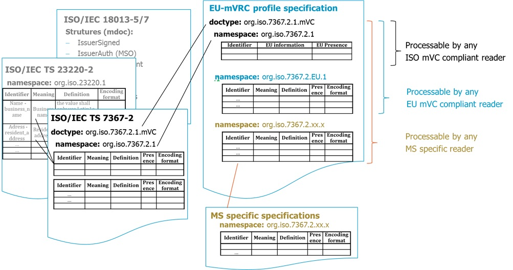

# Attestation Rulebook for attestations of type  *EU-mVRC*

Author(s):

- Matthias Schwan, Bundesdruckerei GmbH, Germany
- Jan Willem Stekelenburg, RDW, the Netherlands

| Version | Date | Description |
| --- | --- | --- |
| 0.2 | 14.02.2026 | first draft of EU-mVRC |

**Feedback:**

- <matthias.schwan@bdr.de>
- <jstekelenburg@rdw.nl>

## 1 Introduction

### 1.1 Document scope and purpose

This document specifies the “European Union mobile Vehicle Registration Certificate (EU-mVRC)” in accordance with EU Directive on the registration documents for vehicles \[EU DIR 2025/0096][EU DIR 1999/37]. An EU-mVRC is a mobile document, i.e. QEAA or Pub-EAA, managed by an EUDI Wallet according to [European Digital Identity Regulation]. The specification of the EU-mVRC is a profile of the mVC specified in [ISO/IEC 7367-2]. The approach of specifying the EU-mVRC profile is given in 2.1. The EU-mVRC as well as the mobile Technical Report (mTR) [ISO/IEC 7367-3] are considered companion documents to the mDL as specified in ARF Annex 3.2 mDL Rulebook.

### 1.2 Document structure

- Chapter 2, which describes the approach of specifying the EU profile of an ISO-mVC
- Chapter 3, which specifies how the attestation, attributes and metadata are encoded in case the attestation complies with [ISO/IEC 18013-5] .
- Chapter 4, which specifies attestation usage.
- Chapter 5, which defines how trust anchors for attestation verification can be obtained.
- Chapter 6, which defines attestation revocation mechanisms.
- Chapter 7, which provides compliance information.
- Annex A, which describes a mapping of data elements of COUNCIL DIRECTIVE to the EU-mVRC

### 1.3 Key words

This document uses the capitalised key words 'SHALL', 'SHOULD' and 'MAY' as
specified in [RFC 2119], i.e., to indicate requirements, recommendations and
options specified in this document.

In addition, 'must' (non-capitalised) is used to indicate an external
constraint, i.e., a requirement that is not mandated by this document, but, for
instance, by an external document. The word 'can' indicates a capability,
whereas other words, such as 'will', and 'is' or 'are' are intended as
statements of fact.

### 1.4 Terminology

This document uses the terminology specified in Annex 1 of the ARF.

## 2 Attestation attributes and metadata

### 2.1 Introduction

This document describes the structure, type, data element identifiers, and logical organisation of the mandatory and optional attributes of the EU-mVRC attestation within the EUDI Wallet. It also describes how Member States can specify any possible national attributes.

The specification of the EU-mVRC is a profile of the mVC specified in [ISO/IEC 7367-2]. The mVC [ISO/IEC 7367-2] references data structures and security mechanisms defined for <credentials:mDL> and <credentials:mdoc>, such as device request/response structures, IssuerSigned and IssuerAuth structures (MSO) as well as protocols for proximity and remote flows. These protocols and structures are mandatory features of the EUDI Wallet ecosystem . The EU-mVRC profile mandates the use of doc type and name space according to [ISO/IEC 7367-2] and gives more detailed information on the use of the data elements. A profile further specifies additional name spaces under responsibility of the EU and of respective Member States.



## 3 Attestation encoding

### 3.1 ISO/IEC 18013-5-compliant encoding

#### 3.1.1 EU mVRC document type and namespace

The objects ``docType`` and ``namespace`` are used to encapsulate the document type and the space in which the data elements are defined.

The document type for the **EU-mVRC** SHALL be as specified in clause 6.1 of [ISO/IEC 7367-2].

The namespace for **EU-mVRC ISO compliant data elements** defined in clause 3.1.2 SHALL be as specified in clause 6.1 of [ISO/IEC 7367-2].

The namespace for **EU-mVRC EU data elements** defined in clause 3.1.3 SHALL be as specified in clauses 6.2.5 and 6.2.6 of [ISO/IEC 7367-2] appended by “EU.1” after a period. The number “1” in the namespace might be increased in future versions of this namespace specification.

Member States MAY add additional namespaces under their responsibility. References to those specifications are given in clause 2.4. The namespace for **EU-mVRC Member State specific data elements** SHALL be as specified in clauses 6.2.5 and 6.2.6 of [ISO/IEC 7367-2] appended by the respective country code of the Member State after a period and optionally followed by a version number.

#### 3.1.2 EU-mVRC ISO compliant data elements

##### 3.1.2.1 Overview

The data elements are specified in Table 1 in clause 3.1.2.2.

— The "Identifier" column is the reference of the data element specified in [ISO/IEC 7367-2].

— The “EU additional description” column gives further information on the usage of the respective data element in the context of [EU DIR 2025/0096].

— The "Presence" column indicates whether the presence of the element on an EU-mVRC is mandatory (M), optional (O) or conditional (C). If an element is conditional the respective condition is given.

##### 3.1.2.2 ISO compliant data elements

The EU-mVRC ISO compliant data elements SHALL be as defined in Table 1 and belong to the namespace given in 3.1.1.

###### Table 1 — ISO compliant data elements

| **Identifier** | **EU additional description** | **Presence** |
| --- | --- | --- |
| ``issue_date`` | no further information | M |
| ``expiry_date`` | EU - corresponding harmonised Union code: <br> **(H)** period of validity<br> Optional data element in ISO/IEC 7367-2<br> mandatory if not unlimited | C  |
| ``issuing_authority_unicode`` | EU - the name of the competent authority according to Annex I, clause (d)(iii) of [EU DIR 2025/0096] | M |
| ``issuing_authority_latin1`` | no further information | M |
| ``issuing_country`` | no further information | M |
| ``issuing_subdivision`` | no further information | O |
| ``document_number`` | no further information<br> Optional data element in ISO/IEC 7367-2 | M |
| ``un_distinguishing_sign`` | no further information | M |
| ``registration_number`` | EU - corresponding harmonised Union code: <br> **(A)** registration number | M |
| ``registration_number_type`` | no further information | O |
| ``register_number`` | no further information | O |
| ``date_of_registration`` | EU - corresponding harmonised Union code: <br> **(I)** date of the registration to which this certificate refers | M |
| ``year_of_manufacturing`` | no further information | O |
| ``date_of_first_registration`` | EU - corresponding harmonised Union code: <br> **(B)** date of first registration of the vehicle<br> Optional data element in ISO/IEC 7367-2 | M |
| ``document_number_techn_insp_report`` | no further information | O |
| ``approval_date_technical_inspection`` | no further information | O |
| ``expiry_date_technical_inspection`` | EU - corresponding harmonised Union code: <br> **(X)** proof of having passed the roadworthiness test, date of next roadworthiness test or expiry of current certificate. expiry date of the technical inspection from the roadworthiness certificate is mandatory if a technical inspection is relevant for the vehicle<br> Optional data element in ISO/IEC 7367-2 | C |
| ``chassis_number`` | EU - corresponding harmonised Union code: <br> **(E)** vehicle identification number <br> eCoC corresponding code: VehicleIdentificationNumber | M |
| ``users`` | EU - corresponding harmonised Union code: <br> **(C.1)** holder of the Registration Certificate <br> Specification according to clause 6.2.3.2 in [ISO/IEC 7367-2] and clause 3.1.2.3<br> Conditional data element in ISO/IEC 7367-2 | M |
| ``owners`` | EU - corresponding harmonised Union code: <br> **(C.2)** owner of the vehicle (repeated as many times as there are owners) <br> Specification according to clause 6.2.3.3 in [ISO/IEC 7367-2] and clause 3.1.2.3<br> Conditional data element in ISO/IEC 7367-2 | O |
| ``basic_vehicle_info`` | Specification according to clause 6.2.4.3 in [ISO/IEC 7367-2] and Table 5 in clause 3.1.2.4  | M |
| ``mass_info`` | Specification according to clause 6.2.4.4 in [ISO/IEC 7367-2] and Table 6 in clause 3.1.2.5 | O |
| ``towed_trailer_mass_info`` | Specification according to clause 6.2.4.5 in [ISO/IEC 7367-2] and Table 7 in clause 3.1.2.6 | O |
| ``engine_info`` | Specification according to clause 6.2.4.6 in [ISO/IEC 7367-2] and Table 8 in clause 3.1.2.7 | O |
| ``seating_info`` | Specification according to clause 6.2.4.7 in [ISO/IEC 7367-2] and Table 9 in clause 3.1.2.8 | O |
| ``dimensions_info`` | Specification according to clause 6.2.4.8 in [ISO/IEC 7367-2] and Table 10 in clause 3.1.2.9 | O |

##### 3.1.2.3   User and owner data elements

The user information in data element ``users`` contains information describing the name and address of the **holder** (C.1) of the vehicle according to [EU DIR 2025/0096]. There SHALL be one holder. The data element ``users`` contains one recorded entity with the specific personal details. A holder SHALL be either a natural person with details given in Table 2 or an organization with details given in Table 3.

The owner information in data element ``owners`` contains information describing the name and address of the recorded **owner(s)** (C.2) of the vehicle according to [EU DIR 2025/0096]. There can be more than one owner. The data element ``owners`` may contain more than one recorded entity with the specific personal details. One recorded entity of an owner shall be either a natural person with details given in Table 2 or an organization with details given in Table 3.

###### Table 2 — NaturalPerson - key details

| **Identifier** | **EU additional description** | **Presence** |
| --- | --- | --- |
| ``full_adress`` | no further information, see Table 4  | M |
| ``family_name`` | EU - corresponding harmonised Union code: <br> **(C.1.1)** surname(s) or business name<br> **(C.2.1)** surname or business name<br> **(C.3.1)** surname or business name<br> Note: applicable if C.1.1, C.2.1 or C.3.1  refer to a natural person | M |
| ``family_name_latin1``| EU - corresponding harmonised Union code: <br> **(C.1.1)** surname(s) or business name<br>  **(C.2.1)** surname or business Name<br>  **(C.3.1)** surname or business Name<br> Note: applicable if C.1.1, C.2.1 or C.3.1 refer to a natural person | O |
| ``given_name`` | EU - corresponding harmonised Union code:<br>  **(C.1.2)** other name(s) or initial(s) (where appropriate)<br>  **(C.2.2)** other name(s) or initial(s) (where appropriate)<br> **(C.3.2)** other name(s) or initial(s) (where appropriate)<br> Note: applicable if C.1.2, C.2.2 or C.3.2refer to a natural Person<br> in case not available use '-'  | M |
| ``given_name_latin1`` | EU - corresponding harmonised Union code:<br> **(C.1.2)** other name(s) or initial(s) (where appropriate)<br> **(C.2.2)** other name(s) or initial(s) (where appropriate)<br>  Note: applicable if C.1.2 or C.2.2 refer to a natural Person<br> **(C.3.2)** other name(s) or initial(s) (where appropriate)<br>  Note: applicable if C.1.2 or C.2.2 refer to a natural Person | O |
| ``supplemental_person_data`` | **(C.1.4)** electronic address (e-mail) of the holder of the registration<br> **(C.2.4)** electronic address (e-mail) of the owner certificate<>EU - corresponding harmonised Union code:<br> In case of a holder optional element **(C.4)** Where the particulars specified in f, code C.2 are not included in the Registration Certificate, reference to the fact that the holder of the Registration Certificate: (a) is the vehicle owner, (b) is not the vehicle owner, (c) is not identified by the Registration Certificate as being the vehicle owner | M |

###### Table 3 — Organization - key details

| **Identifier** | **EU additional description** | **Presence** |
| --- | --- | --- |
| ``full_adress`` | no further information, see Table 4  | M |
| ``organization_name`` | EU - corresponding harmonised Union code: <br> **(C.1.1)** surname(s) or business name <br> **(C.2.1)** surname or business name<br> **(C.3.1)** surname or business name<br> Note: applicable if C.1.1, C.2.1 or C.3.1 refer to an organization | M |
| ``organization_name_latin1`` | EU - corresponding harmonised Union code: <br> **(C.1.1)** surname(s) or business name<br> **(C.2.1)** surname or business name<br> **(C.3.1)** surname or business name<br> Note: applicable if C.1.1, C.2.1 or C.3.1 refer to an organization | O |
| ``supplemental_organization_data`` | no further Information | O |

###### Table 4 — Address - key details

| **Identifier** | **EU additional description** | **Presence** |
| --- | --- | --- |
| ``address`` | EU - corresponding harmonised Union code:<br> **(C.1.3)** address in the Member State of registration, on the date of issue of the document<br> **(C.2.3)** address in the Member State of registration, on the date of issue of the document<br> **(C.3.3)** address in the Member State of registration, on the date of issue of the document | M |
| ``address_latin1`` | EU - corresponding harmonised Union code:<br> **(C.1.3)** address in the Member State of registration, on the date of issue of the document<br> **(C.2.3)** address in the Member State of registration, on the date of issue of the document<br> **(C.3.3)** address in the Member State of registration, on the date of issue of the document | O |
| ``city`` | EU - corresponding harmonised Union code: <br> **(C.1.3)** address in the Member State of registration, on the date of issue of the document<br> **(C.2.3)** address in the Member State of registration, on the date of issue of the document<br> **(C.3.3)** address in the Member State of registration, on the date of issue of the document | M |
| ``city_latin1`` | EU - corresponding harmonised Union code:<br> **(C.1.3)** address in the Member State of registration, on the date of issue of the document<br> **(C.2.3)** address in the Member State of registration, on the date of issue of the document<br> **(C.3.3)** address in the Member State of registration, on the date of issue of the document| O |
| ``state`` | EU - corresponding harmonised Union code:<br> **(C.1.3)** address in the Member State of registration, on the date of issue of the document<br> **(C.2.3)** address in the Member State of registration, on the date of issue of the document<br> **(C.3.3)** address in the Member State of registration, on the date of issue of the document | O |
| ``state_latin1`` | EU - corresponding harmonised Union code:<br> **(C.1.3)** address in the Member State of registration, on the date of issue of the document<br> **(C.2.3)** address in the Member State of registration, on the date of issue of the document<br> **(C.3.3)** address in the Member State of registration, on the date of issue of the document | O |
| ``postal_code`` | EU - corresponding harmonised Union code:<br> **(C.1.3)** address in the Member State of registration, on the date of issue of the document<br> **(C.2.3)** address in the Member State of registration, on the date of issue of the document<br> **(C.3.3)** address in the Member State of registration, on the date of issue of the document | O |
| ``country`` | EU - corresponding harmonised Union code:<br> **(C.1.3)** address in the Member State of registration, on the date of issue of the document<br> **(C.2.3)** address in the Member State of registration, on the date of issue of the document<br> **(C.3.3)** address in the Member State of registration, on the date of issue of the document | M |
| ``supplemental_location_info`` | no further information | O |

##### 3.1.2.4   Basic vehicle info

The basic vehicle information contains information describing the basic data elements of a vehicle according to clause 6.2.4.3 in [ISO/IEC 7367-2].

###### Table 5 — Basic vehicle info key details

| **Identifier** | **EU additional description** | **Presence** |
| --- | --- | --- |
| ``vehicle_category_code`` | EU - the European vehicle category as mentioned in 167/2013, 168/2013 and 2018/858 <br> EU - corresponding harmonised Union code:<br> **(J)** vehicle category<br> eCoC corresponding code: VehicleCategory, mandatory if available | C |
| ``vehicle_category_national`` | no further information | O |
| ``approval_number`` | EU - corresponding harmonised Union code:<br> **(K)** whole-vehicle vehicle type-approval number or the European Individual approval number (if available),<br> CoC corresponding code: TypeApprovalNumber, mandatory if available | C |
| ``make`` | EU - corresponding harmonised Union code:<br> **(D.1)** make<br> eCoC corresponding code: Make | M |
| ``type`` | EU - corresponding harmonised Union code:<br> **(D.2)** type<br>, mandatory if available <br> Optional data element in ISO/IEC 7367-2 | C  |
| ``variant`` | EU - corresponding harmonised Union code:<br> **(D.2.1)** variant<br>, mandatory if available | C |
| ``version`` | EU - corresponding harmonised Union code:<br> **(D.2.2)** version<br>, mandatory if available | C |
| ``commercial_name`` | EU - corresponding harmonised Union code:<br> **(D.3)** commercial description(s)<br> eCoC corresponding code: CommercialName<br> Optional data element in ISO/IEC 7367-2, mandatory if available | C |
| ``colours`` | EU - corresponding harmonised Union code:<br> **(R)** colour of the vehicle<br> eCoC corresponding code: Colour | O |
| ``automation_level`` | no further information | O |
| ``status_vehicle`` | no further information | O |

##### 3.1.2.5   Mass info

The mass information contains information describing the mass data elements of a vehicle in kilograms.

###### Table 6 — mass info key details

| **Identifier** | **EU additional description** | **Presence** |
| --- | --- | --- |
| ``techn_perm_max_laden_mass`` | EU - corresponding harmonised Union code:<br> **(F.1)** maximum technically permissible laden mass, except for motorcycles<br> eCoC corresponding code: TechnPermMaxLadenMass | O |
| ``vehicle_max_mass`` | EU - corresponding harmonised Union code:<br> **(F.2)** maximum permissible laden mass of the vehicle in service in the Member State of registration<br> eCoC corresponding code: InServiceMaximumPermissibleMass | O |
| ``mass_in_running_order`` | EU - corresponding harmonised Union code:<br> **(G)** mass of the vehicle in service with bodywork, and with coupling device in the case of a towing vehicle in service from any category other than M1<br> eCoC corresponding code: MassOfTheVehicleInRunningOrder, mandatory if available | C |
| ``mass_in_running_order_variable_min`` | no further information | O |
| ``mass_in_running_order_variable_max`` | no further information | O |

##### 3.1.2.6 Towed trailer mass info

The towed trailer mass information contains information about the towing vehicle’s maximum allowable towed mass for both unbraked and braked trailers to be coupled in kilograms.

###### Table 7 — Towed trailer mass info key details

| **Identifier** | **EU additional description** | **Presence** |
| --- | --- | --- |
| ``tech_perm_max_tow_mass`` | EU - corresponding harmonised Union code:<br> **(O1)** technically permissible maximum towable mass of the trailer braked (in kg)<br> **(O2)** technically permissible maximum towable mass of the trailer unbraked (in kg)<br> For brake type see braked_type_trail_code | O |
| ``technically_permissible_``<br>``maximum_combination_mass`` | no further information | O |
| ``braked_type_trail_code`` | no further information | O |
| ``type_trailer_code`` | no further information | O |

##### 3.1.2.7 Engine info

The engine information contains information describing the relevant data elements the engine.

###### Table 8 — Engine info key details

| **Identifier** | **EU additional description** | **Presence** |
| --- | --- | --- |
| ``engine_number`` | EU - corresponding harmonised Union code:<br> **(P.5)** engine identification number<br> eCoC corresponding code: EngineNumber | O |
| ``engine_capacity`` | EU - corresponding harmonised Union code:<br> **(P.1)** capacity (in cm3)<br> eCoC corresponding code: EngineCapacity, mandatory if available | C |
| ``engine_power`` | EU - corresponding harmonised Union code:<br> **(P.2)** maximum net power (in kW) (if available)<br> eCoC corresponding code: MaximumNetPower, MaximumContinuousRatedPower, RatedEngineNetPower, , mandatory if available | C |
| ``class_off_hybrid_vehicle_code`` | no further information | O |
| ``energy_source`` | EU - corresponding harmonised Union code:<br> **(P.3)** type of fuel or power source (where applicable)<br> eCoC corresponding code: EnergySource, , mandatory if available | C |

##### 3.1.2.8 Seating info

The seating information contains information describing the seating and standing elements of a vehicle.

###### Table 9 — seating info key details

| **Identifier** | **EU additional description** | **Presence** |
| --- | --- | --- |
| ``number_of_seating_positions_including_driver`` | EU - corresponding harmonised Union code:<br> **(S.1)** number of seats, including the driver's seat<br> eCoC corresponding code: NrOfSeatingPositions, mandatory if available | C |
| ``number_of_standing_places`` | EU - corresponding harmonised Union code:<br> **(S.2)** number of standing places (where appropriate)<br> eCoC corresponding code: NumberOfStandingPlaces, mandatory if available | C |

##### 3.1.2.9   Dimensions info

The dimension information contains details about the dimensions of a vehicle such as wheelbase, length, and width. All details are optional and can be absent.

###### Table 10 — Dimensions info key details

| **Identifier** | **EU additional description** | **Presence** |
| --- | --- | --- |
| ``wheelbase`` | EU - corresponding harmonised Union code:<br> **(M)** wheelbase (in mm)<br> eCoC corresponding code: Wheelbase | C |
| ``wheelbase_adjustable_min`` | no further information | C |
| ``wheelbase_adjustable_max`` | no further information | C |
| ``length`` | no further information | C |
| ``length_adjustable_min`` | no further information | C |
| ``length_adjustable_max`` | no further information | C |
| ``width`` | no further information | C |
| ``width_adjustable_min`` | no further information | C |
| ``width_adjustable_max`` | no further information | C |
| ``height`` | no further information | C |
| ``height_adjustable_min`` | no further information | C |
| ``height_adjustable_max`` | no further information | C |
| ``distance_frontend_centrecoupling`` | no further information | C |
| ``distance_frontend_centrecoupling_adjustable_min`` | no further information | C |
| ``distance_frontend_centrecoupling_adjustable_max`` | no further information | C |
| ``distance_centrecoupling_rearend`` | no further information | C |
| ``distance_centrecoupling_rearend_adjustable_min`` | no further information | C |
| ``distance_centrecoupling_rearend_adjustable_max`` | no further information | C |

#### 3.1.3 EU-mVRC EU data elements

##### 3.1.3.1 Overview

The data elements are specified in Table 11 in clause 3.1.3.2.

— The "Identifier" column is used for ``DataElementIdentifier`` in the mdoc request in accordance with ISO/IEC TS 23220-4.

— The "Presence" column indicates whether the presence of the element on an mVC is mandatory (M), optional (O) or conditional (C). If an element is conditional the respective condition is given.

— The “Encoding format” column indicates how the data elements SHALL be encoded. “tstr”, “uint”, “bstr”, “bool” and “tdate” are CDDL representation types as defined in RFC 8610. “full-date” SHALL be implemented according to the additional information tag 1004 for full-date elements as defined in RFC 8943.

— The following requirements SHALL apply to dates in EU-mVRC data elements unless otherwise indicated and when applicable: Dates SHALL not use fraction of seconds. No local offset from UTC SHALL be used, as indicated by setting the time-offset defined in RFC 3339 to “Z”.

##### 3.1.3.2 EU data elements

The EU data elements are grouped in five main data elements as given in Table 11. If an optional data element is encoded, it must contain at minimum all mandatory elements defined in the sub-structures.

###### Table 11 - EU data elements - key details

| **Identifier** | **Meaning** | **Description** | **Presence** | Encoding format |
| --- | --- | --- | --- | --- |
| ``vehicle_info_ext_eu`` | Vehicle info extended EU | The vehicle information specified in the European namespace | O | See 3.1.3.3 |
| ``consumer_info_eu`` | Consumer info EU | EU - corresponding harmonised Union code:<br> **C.3)** natural or legal person who may use the vehicle by virtue of a legal right other than that of ownership | O | See 3.1.3.4 |
| ``axle_info_eu`` | Axle info | The axle information of a vehicle | O | See 3.1.3.5 |
| ``env_info_eu`` | Environmental info | Environmental info of a vehicle | O | See 3.1.3.6 |

##### 3.1.3.3 Vehicle info extended EU

The data element ``vehicle_info_ext_eu`` contains information describing extra common data elements of the vehicle. The definition of the elements in the extended vehicle information is given in Table 12.

The structure is absent when none of the data elements are applicable.

The ``VehicleInfoExtEU`` structure SHALL be encoded as <credentials:CBOR> for device retrieval and SHALL be formatted as following <credentials:CDDL> structure:

```cddl
VehicleInfoExtEU = {
 ? "bodywork" : tstr,                           ; according to Table 12
 ? "whole_vehicle_max_mass" : uint,             ; according to Table 12
 ? "power_mass_ratio" : uint,                   ; according to Table 12
 ? "rated_speed" : uint,                        ; according to Table 12
 ? "max_speed" : uint,                          ; according to Table 12
 ? "fuel_tank" : uint,                          ; according to Table 12
}
```

###### Table 12 – Vehicle info extended EU data elements - key details

| **Identifier** | **Meaning** | **Description** | **Presence** | Encoding format |
| --- | --- | --- | --- | --- |
| ``bodywork`` | Bodywork | EU - corresponding harmonised Union code:<br> **(J.21)** bodywork<br> eCoC corresponding code: CodeForBodywork, mandatory if available | C  | tstr |
| ``whole_vehicle_max_mass`` | Whole vehicle maximum mass | EU - corresponding harmonised Union code:<br> **(F.3)** maximum permissible laden mass of the whole vehicle in service in the Member State of registration<br> eCoC corresponding code: InServiceMaximumPermissibleMassCombination | O | uint |
| ``power_mass_ratio`` | Power mass ratio | EU - corresponding harmonised Union code:<br> **(Q)** power/weight ratio (in kW/kg) (only for motorcycles)<br> eCoC corresponding code: PowerMassRatio, mandatory if available | C  | uint |
| ``rated_speed`` | Rated speed | EU - corresponding harmonised Union code:<br> **(P.4)** rated speed (in min-1) | O | uint |
| ``max_speed`` | Maximum speed | EU - corresponding harmonised Union code:<br> **(T)** maximum speed (in km/h)<br> eCoC corresponding code: MaximumSpeed | O | uint |
| ``fuel_tank`` | Capacity fuel tank | EU - corresponding harmonised Union code:<br> **(W)** fuel tank(s) capacity (in litres) | O | uint |

##### 3.1.3.5 Consumer info extended EU

The data element ``consumer_info_ext_eu`` contains information describing the name and address of the recorded consumer of the vehicle. A consumer is natural person or organization who may use the vehicle by virtue of a legal right other than that of ownership. There can only be one consumer. The definition of the elements in the personal information are given in paragraph 6.2.3.2 User information of [ISO/IEC 7367-2] and Table 2, Table 3 and Table 4 of this document.

The structure is absent when none of the data elements is applicable.

The ``ConsInfoExt`` structure SHALL be encoded as CBOR for device retrieval and SHALL be formatted as following CDDL structure:

```cddl
ConsInfoExt = {
 ? naturalPerson: NaturalPerson,     ; according to paragraph 6.2.3.2 User information of [ISO/IEC 7367-2] and Table 2 of this document
 ? organization: Organization        ; according to paragraph 6.2.3.2 User information of [ISO/IEC 7367-2] and Table 3 of this document
}
```

##### 3.1.3.6 Axle info EU

The data element ``axle_info_eu`` contains details about the distribution of the technically permissible maximum laden mass among the axles of vehicles with a total exceeding 3 500 kg. The definition of the elements in the axle information can be found in Table 13.

The structure is absent when none of the data elements is applicable.

The ``AxleInfoEU`` structure SHALL be encoded as CBOR for device retrieval and SHALL be formatted as following CDDL structure:

```cddl
AxleInfoEU = {
 ? "number_of_axles" : uint,                ; according to Table 13
 ? "axle_info" : [+ axledata]               ; according to Table 13
 }
axledata =  {
 ? "axle_number" : uint,                    ; according to Table 13
 ? "techn_perm_max_laden_mass_axle" : uint  ; according to Table 13
 }
```

###### Table 15 — Axle info EU key details

| **Identifier** | **Meaning** | **Description** | **Presence** | Encoding format |
| --- | --- | --- | --- | --- |
| ``number_of_axles`` | Number of axles | EU - corresponding harmonised Union code:<br> **(L)** number of axles<br> eCoC corresponding code: numberOfAxles | O | uint |
| ``axle_number`` | Axle number | EU - corresponding harmonised Union code:<br> **(N)** axle 1 (in kg), where appropriate | O | uint |
| ``techn_perm_max_laden_mass_axle`` | technically permissible maximum laden mass on the axle | EU - corresponding harmonised Union code:<br> **(N)** (in kg), where appropriate | O | uint |

##### 3.1.3.7 Environmental info EU

The data element ``env_info_eu`` contains about the environmental aspects of vehicles. The definition of the elements in the environmental information can be found in Table 14.

The structure is absent when none of the data elements is applicable.

The ``EnvInfoEU`` structure SHALL be encoded as CBOR for device retrieval and SHALL be formatted as following CDDL structure:

```cddl
EnvInfoEU = {
 ? "sound_stat" : uint,               ; according to Table 14
 ? "sound_speed" : uint,              ; according to Table 14
 ? "sound_drive_by" : uint,           ; according to Table 14
 ? "co" : uint,                       ; according to Table 14
 ? "co_unit" : tstr,                  ; according to Table 14
 ? "thc" : uint,                      ; according to Table 14
 ? "thc_unit" : tstr,                 ; according to Table 14
 ? "nox" : uint,                      ; according to Table 14
 ? "nox_unit" : tstr,                 ; according to Table 14
 ? "thc_nox" : uint,                  ; according to Table 14
 ? "thc_nox_unit" : tstr,             ; according to Table 14
 ? "pm" : uint,                       ; according to Table 14
 ? "pm_unit" : tstr,                  ; according to Table 14
 ? "corr_abs_coefficient" : uint,     ; according to Table 14
 ? "co2" : uint,                      ; according to Table 14
 ? "co2_unit" : tstr,                 ; according to Table 14
 ? "comb_fuel_consumption" : uint,    ; according to Table 14
 ? "environmental_category" : tstr,   ; according to Table 14
 ? "co2_emission_class" : tstr,       ; according to Table 14
}
```

###### Table 14 — Environmental info EU key details

| **Identifier** | **Meaning** | **Description** | **Presence** | Encoding format |
| --- | --- | --- | --- | --- |
| ``sound_stat`` | sound level stationary | EU - corresponding harmonised Union code:<br> **(U.1)** sound level stationary (in dB(A))<br> eCoC corresponding code: SoundLevelStationary | O | uint |
| ``sound_speed`` | sound level engine speed | EU - corresponding harmonised Union code:<br> **(U.2)** sound level engine speed (in min-1)<br> eCoC corresponding code: SoundLevelStationaryEngineSpeed | O | uint |
| ``sound_drive_by`` | sound level drive-by | EU - corresponding harmonised Union code:<br> **(U.3)** sound level drive-by (in dB(A)) | O | uint |
| ``co`` | CO | EU - corresponding harmonised Union code:<br> **(V.1)** Value of the CO ((in g/km, mg/km, g/kWh or mg/kWh) | O | uint |
| ``co_unit`` | unit of CO | unit ((in g/km, mg/km, g/kWh or mg/kWh) of the CO as mentioned in item CO, mandatory in case of a CO-value, not present if co-element is not present<br> EU - corresponding harmonised Union code:<br> **(V.1)** Value of the CO ((in g/km, mg/km, g/kWh or mg/kWh) | C | tstr |
| ``thc`` | THC | EU - corresponding harmonised Union code:<br> **(V.2)** THC (in g/km or g/kWh) | O | uint |
| ``thc_unit`` | unit of THC | unit ((in g/km, mg/km, g/kWh or mg/kWh) of the THC as mentioned in item thc, mandatory in case of a thc-value, not present if thc-element is not present<br> EU - corresponding harmonised Union code:<br> **(V.2)** THC (in g/km or g/kWh) | C | tstr |
| ``nox`` | NOx | EU - corresponding harmonised Union code:<br> **(V.3)** NOx (in g/km, mg/km, g/kWh or mg/kWh) | O | uint |
| ``nox_unit`` | unit of NOx | unit (in g/km or/kWh) of the NOx as mentioned in item nox, mandatory in case of a nox-value, not present if nox-elment is not present<br> EU - corresponding harmonised Union code:<br> **(V.3)** NOx (in g/km, mg/km, g/kWh or mg/kWh) | C | tstr |
| ``thc_nox`` | THC and NOx | EU - corresponding harmonised Union code:<br> **(V.4)** THC + NOx (in g/km) | O | uint |
| ``thc_nox_unit`` | unit of THC and NOx | unit (in g/km) of the THC and NOx as mentioned in item thc_nox, mandatory in case of a thc_nox-value, not present if thc_nox-element is not present<br> EU - corresponding harmonised Union code:<br> **(V.4)** THC + NOx (in g/km) | C | tstr |
| ``pm`` | Mass of particulate matter | EU - corresponding harmonised Union code:<br> **(V.5)** Mass of particulate matter (PM) (in g/km or g/kWh) | O | uint |
| ``pm_unit`` | unit of Mass of particulate matter | unit  (in g/km or g/kWh) of the mass of particulate matter (PM) as mentioned in item pm, mandatory in case of a pm-value, not present if pm-element is not present<br> EU - corresponding harmonised Union code:<br> **(V.5)** Mass of particulate matter (PM) (in g/km or g/kWh) | C | tstr |
| ``corr_abs_coefficient`` | corrected absorption coefficient | EU - corresponding harmonised Union code:<br> **(V.6)** corrected absorption coefficient for diesel (in min-1) | O | uint |
| ``co2`` | CO2 | EU - corresponding harmonised Union code:<br> **(V.7)** CO2 (in g/km) or Specific CO2 emissions where indicated at entry 49.5 of the Certificate of Conformity of heavy-duty vehicles defined in the Appendix to Annex VIII to Commission Implementing Regulation (EU) 2020/6831 or at entry 49.5 of the individual vehicle approval certificate defined in Appendix 1 to Annex III to that Regulation, mandatory if available | C  | uint |
| ``co2_unit`` | unit of CO2 | unit  (in g/km or g/kWh) of the CO2 as mentioned in item CO2, mandatory in case of a CO2-value, not present if CO2-element is not present<br> EU - corresponding harmonised Union code:<br> **(V.7)** CO2 (in g/km) or Specific CO2 emissions where indicated at entry 49.5 of the Certificate of Conformity of heavy-duty vehicles defined in the Appendix to Annex VIII to Commission Implementing Regulation (EU) 2020/6831 or at entry 49.5 of the individual vehicle approval certificate defined in Appendix 1 to Annex III to that Regulation | C | tstr |
| ``comb_fuel_consumption`` | combined fuel consumption | EU - corresponding harmonised Union code:<br> **(V.8)** combined fuel consumption (in l/100 km), | O | uint |
| ``environmental_category`` | exhaust emission level environmental category | EU - corresponding harmonised Union code:<br> **(V.9)** indication of the exhaust emission level environmental category at entry 47 of part 2 of the Certificate of Conformity as defined in the Appendix to Annex VIII to Commission Implementing Regulation (EU) 2020/683 or at entry 47 of the individual approval certificate defined in Appendix 1 to Annex III to that Regulation, mandatory if available | C  | tstr |
| ``co2_emission_class`` | CO2 emission class | EU - corresponding harmonised Union code:<br> **(V.10)** CO2 emission class of heavy-duty vehicles determined at the moment of first registration, in accordance with Article 7ga(2) of Directive 1999/62/EC of the European Parliament and of the Council (5) | O | tstr |

## 4 Attestation usage

Use Case of an mVC are given in Annex A.1 and A.2 of [ISO/IEC 7367-2]. Moreover, a typical inspection procedure in a law enforcement use case includes the verification of an mDL, an mVC and mTR in one single request.

## 5 Trust anchors

The certificates specified in Annex C of [ISO/IEC 7367-2] SHALL be used. The Pub-EAA provider MAY use the IACA already set up for mDL according to Annex C of [ISO/IEC 7367-2] or may establish a separate IACA.

## 6 Revocation

If revocation of mVC is required the Pub-EAA provider SHALL provide a status list according to  [ISO/IEC 18013-5.2].

## 7 Compliance

The specification of the mVC is compliant to the ARF, i.e. the mdoc encoding of a Pub-EAA, and [ISO/IEC 7367-2] as well as with [EU DIR 2025/0096].

## 8 References

| **Item Reference** | **Standard name/details**|
| --- | --- |
| [European Digital Identity Regulation] | [Regulation (EU) 2024/1183](https://eur-lex.europa.eu/legal-content/EN/TXT/HTML/?uri=OJ:L_202401183) of the European Parliament and of the Council of 11 April 2024 amending Regulation (EU) No 910/2014 as regards establishing the European Digital Identity Framework |
| [HAIP] | Yasuda, K. *et al,* OpenID4VC High Assurance Interoperability Profile, OpenId Foundation, Version draft-03 |
| [IANA-JWT-Claims] | IANA JSON Web Token Claims Registry. Available: <https://www.iana.org/assignments/jwt/jwt.xhtml> |
| [ISO/IEC 18013-5] |  ISO/IEC 18013-5, Personal identification --- ISO-compliant driving licence - Part 5: Mobile driving licence (mDL) application, First edition, 2021-09 |
| [ISO/IEC 18013-5.2] |  ISO/IEC 18013-5, Personal identification --- ISO-compliant driving licence - Part 5: Mobile driving licence (mDL) application, second edition, 2026-xx (Status DIS) |
| [OIDC] | Sakimura, N. et al., "OpenID Connect Core 1.0", OpenID Foundation. Available: <https://openid.net/specs/openid-connect-core-1_0.html> |
| [RFC 3339] | RFC 3339  - Date and Time on the Internet: Timestamps, G. Klyne et al., July 2002 |
| [RFC 8610] | RFC 8610  - Concise Data Definition Language (CDDL): A Notational Convention to Express Concise Binary Object Representation (CBOR) and JSON Data Structures, H. Birkholz et al., June 2019 |
| [RFC 8943] | RFC 8943  - Concise Binary Object Representation (CBOR) Tags for Date, M. Jones et al., November 2020 |
| [RFC 8949] | RFC 8949 - Concise Binary Object Representation (CBOR), C. Bormann et al., December 2020 |
| [SD-JWT VC] |  SD-JWT-based Verifiable Credentials (SD-JWT VC). Available: <https://datatracker.ietf.org/doc/draft-ietf-oauth-sd-jwt-vc/>, version draft-ietf-oauth-sd-jwt-vc-09  |
| [Topic 7] | ARF Annex 2 - Topic 7 - Attestation revocation and revocation checking Available: <https://eu-digital-identity-wallet.github.io/eudi-doc-architecture-and-reference-framework/latest/annexes/annex-2/annex-2-high-level-requirements/#a237-topic-7-attestation-revocation-and-revocation-checking>|
| [Topic 10] | ARF Annex 2 - Topic 10 - Issuing a PID or attestation to a Wallet Unit: <https://eu-digital-identity-wallet.github.io/eudi-doc-architecture-and-reference-framework/latest/annexes/annex-2/annex-2-high-level-requirements/#a2310-topic-10-issuing-a-pid-or-attestation-to-a-wallet-unit>|
| [Topic 12] | ARF Annex 2 - Topic 12 - Attestation Rulebooks, Available: <https://eu-digital-identity-wallet.github.io/eudi-doc-architecture-and-reference-framework/latest/annexes/annex-2/annex-2-high-level-requirements/#a2312-topic-12-attestation-rulebooks>|
| [Topic 20] | ARF Annex 2 - Strong User authentication for electronic payments, Available: <https://eu-digital-identity-wallet.github.io/eudi-doc-architecture-and-reference-framework/latest/annexes/annex-2/annex-2-high-level-requirements/#a2320-topic-20-strong-user-authentication-for-electronic-payments>|
| [W3C VCDM v2.0] | Sporny, M. *et al,* Verifiable Credentials Data Model v2.0, W3C Recommendation.  |
| [ISO/IEC 18013-7] | ISO/IEC TS 18013-7: Personal identification — ISO-compliant driving licence — Part 7:Mobile driving licence (mDL) add-on functions |
| [ISO/IEC 23220-4] | ISO/IEC TS 23220-4: Cards and Security Devices for Personal Identification – Building Blocks for Identity Management via Mobile Devices –Part 4: Protocols and services for the operational phase |
| [ISO/IEC 7367-2] | ISO/IEC TS 7367-2: Personal identification – ISO compliant mdoc schemas – Part 2: Mobile Vehicle Certificate, 2026 (current status is DTS) |
| [ISO/IEC 7367-3] | ISO/IEC TS 7367-3: Personal identification – ISO compliant mdoc schemas – Part 3: Mobile Technical Report, 2026 (current status is NWIP) |
| [EU DIR 2025/0096] | COUNCIL DIRECTIVE 2025/0096 on the registration documents for vehicles and vehicle registration data recorded in national vehicle registers (repealing Council Directive 1999/37/EC, [EU DIR 1999/37]), Draft 27.11.2025, <https://eur-lex.europa.eu/legal-content/EN/TXT/?uri=CELEX:52025PC0179> |
| [EU DIR 1999/37] | COUNCIL DIRECTIVE 1999/37/EC of 29 April 1999 on the registration documents for vehicles |

## Annex A Mapping of data elements of COUNCIL DIRECTIVE

A mapping from elements of Part 1 of the Registration Certificate defined in Annex I of [EU DIR 2025/0096] to the data elements defined in clause 3 is given in Table A.1.

### Table A.1 — Mapping of data elements of COUNCIL DIRECTIVE to EU-mVRC

| **Part I (M/C/O)** | **mVRC (M/C/O)** | **Community Code** | **Description** | **Data element identifier** |
| --- | --- | --- | --- | --- |
| M | M | - | name of the Member State issuing the Registration Certificate |``issuing_country`` in<br>ISO namespace|
| M | M | - | the name of the competent authority | ``issuing_authority_unicode`` in<br> ISO namespace |
| M | M | - | the unambiguous consecutive number of the document as used within the Member State | ``document_number`` in <br> ISO namespace |
| M | M | A | registration number | ``registration_number`` in<br> ISO namespace |
| M | M | B | date of first registration of the vehicle | ``date_of_first_registration`` in <br> ISO namespace |
| M | M | I | date of the registration to which this certificate refers | ``date_of_registration`` in<br> ISO namespace |
| - | - | C | personal data | - |
| - | - | C.1 | holder of the Registration Certificate: | ``users`` in<br> ISO namespace |
| M | M | C.1.1 | surname(s) or business name | ``users`` in<br> ISO namespace |
| M | M | C.1.2 | other name(s) or initial(s) (where appropriate) | ``users`` in<br> ISO namespace |
| M | M | C.1.3 | address in the Member State of registration on the date of issue of the document | ``users`` in<br> ISO namespace |
| M | M | C.4 | Where the particulars specified in II.6, code C.2 are not included in the Registration Certificate, reference to the fact that the holder of the Registration Certificate:<br> (a) is the vehicle owner,<br> (b) is not the vehicle owner,<br> (c) is not identified by the Registration Certificate as being the vehicle owner; | ``supplemental_person_data`` in<br> ISO name space |
| - | - | D | vehicle | - |
| M | M | D.1 | make | ``make`` in<br> ISO namespace |
| M | C | D.2 | type | ``type``in <br> ISO namespace |
| C | C | D.2.1 | variant (if available) | ``variant in``<br> ISO namespace |
| C | C | D.2.2 | version (if available); | ``version`` in<br> ISO namespace |
| M | C | D.3 | commercial description(s) | ``commercial_name`` in<br> ISO namespace |
| M | M | E | vehicle identification number | ``chassis_number`` in<br> ISO namespace |
| - | - | F | mass: | - |
| O | O | F.1 | maximum technically permissible laden mass, except for motorcycles | ``techn_perm_max_laden_mass`` in<br> ISO namespace |
| C | C | G | mass of the vehicle in service with bodywork, and with coupling device in the case of a towing vehicle in service from any category other than M1 | ``mass_in_running_order`` in<br> ISO namespace |
| C | C | H | period of validity, if not unlimited | ``issue_date`` and ``expiry_date`` in<br> ISO namespace |
| C | C | K | type-approval number (if available) | ``approval_number`` in<br> ISO namespace |
| M | C | J | vehicle category | ``vehicle_category_code`` in<br> ISO name space |
| M | C | J.21 | bodywork | ``vehicle_info_ext_eu`` in<br> EU name space |
| - | - | P | engine; | |
| M | C | P.1 | capacity (in cm3) | ``engine_capacity`` in<br> ISO namespace |
| C | C | P.2 | maximum net power (in kW) (if available) | ``engine_power`` in<br> ISO namespace |
| C | C | P.3 | type of fuel or power source | ``energy_source`` in<br> ISO namespace |
| C | C |  Q | power/weight ratio (in kW/kg) (only for motorcycles) | ``power_mass_ratio`` in<br> EU namespace |
| M | C |  S.1 | number of seats, including the driver's seat | ``number_of_seating_positions_including_driver`` in<br> ISO namespace |
| C | C |  S.2 | number of standing places (where appropriate) | ``number_of_standing_places`` in<br> ISO namespace |
| O | O |  C.1.4 | electronic address (e-mail) of the holder of the registration certificate | ``supplemental_person_data`` in<br> ISO namespace<br> ``supplemental_organization_data`` in<br> ISO namespace|
| - | - |  C.2 | owner of the vehicle (repeated as many times as there are owners), | ``owners`` in<br> ISO namespace |
| O | O |  C.2.1 | surname or business name | ``owners`` in<br> ISO namespace |
| O | O |  C.2.2 | other name(s) or initial(s) (where appropriate), | ``owners`` in<br> ISO namespace |
| O | O |  C.2.3 | address in the Member State of registration, on the date of issue of the document | ``owners`` in<br> ISO namespace |
| O | O |  C.2.4 | electronic address (e-mail) of the owner | ``supplemental_person_data`` in<br> ISO namespace<br> ``supplemental_organization_data`` in<br> ISO namespace |
| - | - |  C.3 | natural or legal person who may use the vehicle by virtue of a legal right other than that of ownership | ``consumers`` in<br> EU namespace |
| O | O |  C.3.1 | surname or business name | ``consumers`` in<br> EU namespace |
| O | O |  C.3.2 | other name(s) or initial(s) (where appropriate), | ``consumers`` in<br> EU namespace |
| O | O |  C.3.3 | address in the Member State of registration, on the date of issue of the document | ``consumers`` in<br> EU namespace |
| O | O |  C.5, C.6,<br> C.7, C.8 | where a change in the personal data given in code C.1, code C.2 and/or code C.3 does not give rise to the issue of a new Registration Certificate, the new personal data corresponding to these points may be included under codes (C.5), (C.6), (C.7) or (C.8); they are then broken down in accordance with the references in code C.1, code C.2,  code C3, code C4. | t.b.d |
| - |  F  | mass | | |
| O | O | F.2 | maximum permissible laden mass of the vehicle in service in the Member State of registration | ``vehicle_max_mass`` in<br> ISO namespace |
| O | O | F.3 | maximum permissible laden mass of the whole vehicle in service in the Member State of registration | ``mass_in_running_order_variable_max`` in<br> ISO namespace |
| O | O | J | vehicle category | ``vehicle_category_code`` in<br> ISO namespace |
| O | O | L | number of axles | ``axle_info_eu`` in<br> EU namespace |
| O | O | M | wheelbase (in mm) | ``wheelbase`` in<br> ISO namespace |
| - | - | N | for vehicles with a total exceeding 3 500 kg, distribution of the technically permissible maximum laden mass among the axles |  |
| O | O | N.1 - <br>N.5 | axle (in kg) | ``axle_info_eu`` in<br> EU namespace |
| - | - |  O | technically permissible maximum towable mass of the trailer |  |
| O | O |  O.1 | braked (in kg) | ``tech_perm_max_tow_mass`` in<br> EU namespace |
| O | O |  O.2 | unbraked (in kg) | ``tech_perm_max_tow_mass`` in<br> EU namespace |
| - | - |  P | Engine |  |
| O | O |  P.4 | rated speed (in min -1 ) | ``rated_speed`` in<br> ISO namespace |
| O | O |  P.5 | engine identification number | ``engine_number`` in<br> ISO namespace |
| O | O |  R | colour of the vehicle | ``colours`` in<br> ISO namespace |
| O | O |  T | maximum speed (in km/h) | ``vehicle_info_ext_eu`` in<br> EU namespace |
| - | - |  U | sound level |  |
| O | O |  U.1 | stationary (in dB(A)) | ``env_info_eu`` in<br> EU namespace |
| O | O |  U.2 | engine speed (in min-1) | ``env_info_eu`` in<br> EU namespace |
| O | O |  U.3 | drive-by (in dB(A)); (V) exhaust emissions | ``env_info_eu`` in<br> EU namespace |
| - | - |  V | Exhaust emissions |  |
| O | O |  V.1 | CO (in g/km, mg/km, g/kWh or mg/kWh) | ``env_info_eu`` in<br> EU namespace |
| O | O |  V.2 | THC (in g/km, mg/km, g/kWh or mg/kWh) | ``env_info_eu`` in<br> EU namespace |
| O | O |  V.3 | NOx (in g/km, mg/km, g/kWh or mg/kWh) | ``env_info_eu`` in<br> EU namespace |
| O | O |  V.4 | THC + NOx (in g/km) | ``env_info_eu`` in<br> EU namespace |
| O | O |  V.5 | Mass of particulate matter (PM) (in g/km or g/kWh) | ``env_info_eu`` in<br> EU namespace |
| O | O |  V.6 | corrected absorption coefficient for diesel (in min-1) | ``env_info_eu`` in<br> EU namespace |
| M | C |  V.7 | CO 2 (in g/km) or Specific CO 2 emissions where indicated at position 49.5 of the Certificate of Conformity of heavy-duty vehicles defined in the Appendix to Annex VIII to Commission Implementing Regulation (EU) 2020/683 (1 )  or at position 49.5 of the individual vehicle approval certificate defined in Appendix 1 to Annex III to that Regulation | ``env_info_eu`` in<br> EU namespace |
| O | O |  V.8 | combined fuel consumption (in l/100 km) | ``env_info_eu`` in<br> EU namespace |
| M | C |  V.9 | indication of the exhaust emission level environmental category at entry 47 of part 2 of the Certificate of Conformity as defined in the Appendix to Annex VIII to Commission Implementing Regulation (EU) 2020/683 or at entry 47 of the individual approval certificate defined in Appendix 1 to Annex III to that Regulation | ``env_info_eu`` in<br> EU namespace |
| O | O |  V.10 | CO2 emission class of heavy-duty vehicles determined at the moment of first registration, in accordance with Article 7ga(2) of Directive 1999/62/EC of the European Parliament and of the Council (5) | ``env_info_eu`` in<br> EU namespace |
| O | O |  W | fuel tank(s) capacity (in litres)  | ``fuel_tank`` in<br> ISO namespace |
| O | O |  X | proof of having passed the roadworthiness test, date of next roadworthiness test or expiry of current certificate on mobile registration certificates | ``expiry_date_technical_inspection`` in<br> ISO  namespace|
