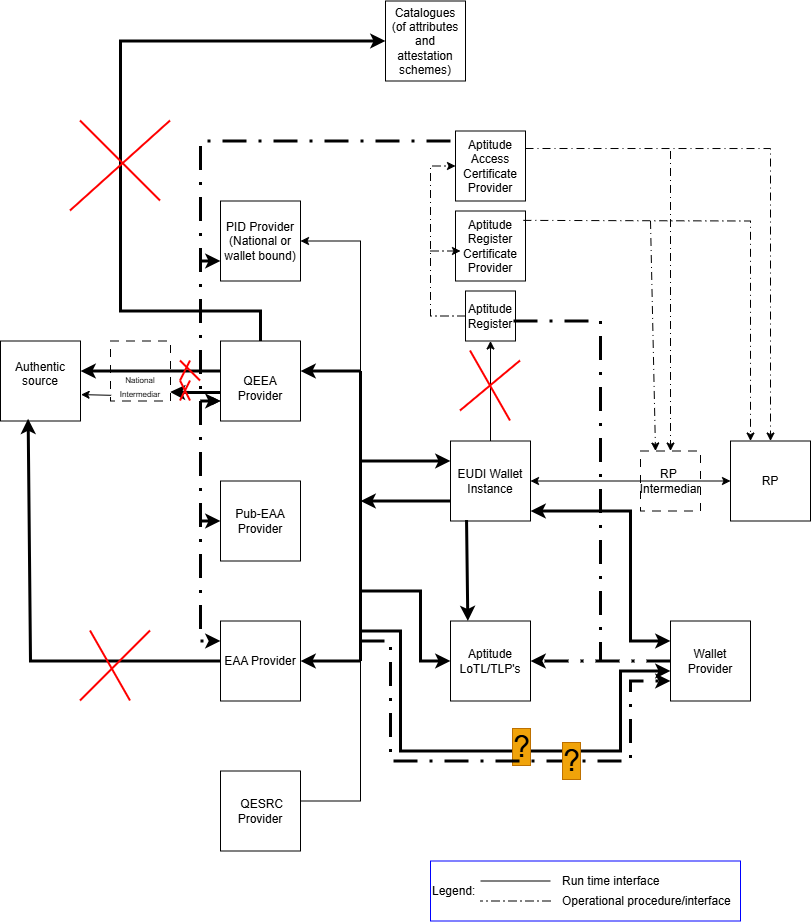
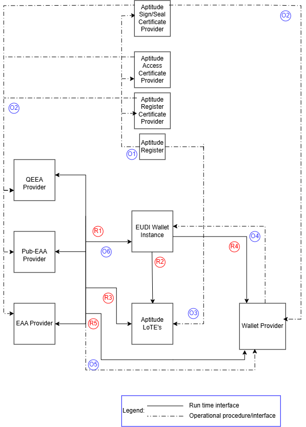
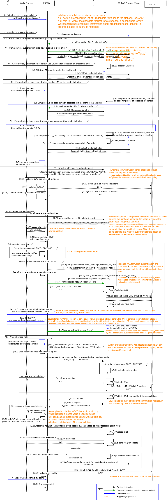

# Generic issuance flow specification

Version 0.1 (draft)

## Authors

1. Aleksandar Simsic, ICTU
2. ....
3. ....

## Reviewers

1. Degani Giancarlo, Infocert
2. ...

## Table of Contents

1. Introduction
2. Aptitude landscape overview
   * 2.1 Relation between different standards and interfaces
3. Interaction details
   * 3.1 Flow requirements
     * 3.1.1 OID4VCI requirements
     * 3.1.2 HAIP requirements
     * 3.1.3 ETSI 119 472-3 requirements
     * 3.1.4 Additional trust framework validation requirements
   * 3.2 Detailed technical flow description (sequence diagram)
     * 3.2.1 Steps mapping overview

## 1 Introduction

This document is **APTITUDE horizontal interoperability flow** **specification for the generic credential issuance flow**. It provides high level overview linking on the one side defined architecture with wallet ecosystem roles and their interaction from ARF and on another hand links each line from the provided detailed sequence diagram towards API/message/process described in one of the underlying RFC specifications.

By doing so implementing parties have clear and coherent guideline on exactly what needs to be implemented to support Aptitude generic issuance flow.

## 2\. Aptitude landscape overview

Following diagram uses EUDI Wallet ecosystem roles diagram from [ARF 2.9](https://eudi.dev/2.9.0/architecture-and-reference-framework-main/#3-roles-within-the-eudi-wallet-ecosystem) as base and presents adaptations relevant for issuance process within
the Aptitude LSP.

Aptitude has several specifics on how the trust framework specific roles are filled in where it differs from the way that the related roles will finally being filled in within the full production setup in the Europe.

Here we are only clarifying which roles and/or interfaces are out of the scope of this flow specification:

| Interface | Description | Rationale |
|-----------|-------------|-----------|
| Authentic Source → Issuer | How the Issuer retrieves data from the national authentic source | Assumed to be resolved at national level by each partner acting as Issuer |
| QTSP → Attribute Catalogue | Citizen-initiated flow where a QTSP validates and issues a VC from scratch | No WP in APTITUDE covers this scenario |
| Wallet → APTITUDE Register (runtime) | Runtime lookup from Wallet to APTITUDE Register | Redundant: WRPRC is provisioned at onboarding time (design-time); registration certificate is becoming mandatory per 2025/848 IA |

### 2.1 Relation between different standards and interfaces

Following diagram uses Aptitude EUDI Wallet ecosystem diagram as starting point, keeping in the picture just the roles that are relevant for the scope of this flow specification. It labels each interaction between the two roles and classifies each interface as a design time (blue label) or as a runtime (red label) interface.

In following table for each identified interface one or more of the relevant standards are listed. Further down within this flow specification these interfaces and related standards will be further used and referenced.

<table>
<colgroup>
<col style="width: 12%" />
<col style="width: 45%" />
<col style="width: 41%" />
</colgroup>
<thead>
<tr>
<th style="text-align: center;"><strong>Interface</strong></th>
<th style="text-align: center;"><strong>Applicable
standards</strong></th>
<th style="text-align: center;"><strong>Additional comment</strong></th>
</tr>
</thead>
<tbody>
<tr>
<td>O1</td>
<td><a
href="https://github.com/eu-digital-identity-wallet/eudi-doc-standards-and-technical-specifications/blob/main/docs/technical-specifications/ts6-common-set-of-rp-information-to-be-registered.md">TS6</a>,</td>
<td>Register party with its role (Issuer/Wallet Provider)</td>
</tr>
<tr>
<td>O2</td>
<td><a
href="https://www.etsi.org/deliver/etsi\\\_ts/119400\\\_119499/11941108/01.01.01\\\_60/ts\\\_11941108v010101p.pdf">ETSI
TS 119 411-8</a>, <a
href="https://www.etsi.org/deliver/etsi\\\_ts/119400\\\_119499/119475/01.02.01\\\_60/ts\\\_119475v010201p.pdf">ETSI
TS 119 475</a></td>
<td>Distribution of WRPASs \\\&amp; WRPRCs</td>
</tr>
<tr>
<td>O3</td>
<td><a
href="https://github.com/eu-digital-identity-wallet/eudi-doc-standards-and-technical-specifications/blob/main/docs/technical-specifications/ts2-notification-publication-provider-information.md">TS2</a></td>
<td>Notifying TLP’s for related TL’s (Wallet Providers, (Pub-)EAA
Providers, Providers of Access and Register Certificate)</td>
</tr>
<tr>
<td>O4</td>
<td><a
href="https://github.com/eu-digital-identity-wallet/eudi-doc-standards-and-technical-specifications/blob/main/docs/technical-specifications/ts3-wallet-unit-attestation.md">TS3</a></td>
<td>Issuing of WUAs (WIA \\\&amp; KAs) for WI</td>
</tr>
<tr>
<td>R1</td>
<td>
<a
href="https://openid.net/specs/openid-4-verifiable-credential-issuance-1\\\_0.html">OID4VCI</a>,
<a
href="https://openid.net/specs/openid4vc-high-assurance-interoperability-profile-1\\\_0.html">HAIP</a>,
<a
href="https://www.etsi.org/deliver/etsi\\\_ts/119400\\\_119499/11947203/01.01.01\\\_60/ts\\\_11947203v010101p.pdf">ETSI
TS 119 472-3</a>

ISO18013-5, <a
href="https://datatracker.ietf.org/doc/draft-ietf-oauth-sd-jwt-vc/15">SD-JWT
VC</a>, <a
href="https://www.etsi.org/deliver/etsi\\\_ts/119400\\\_119499/11947201/01.01.01\\\_60/ts\\\_11947201v010101p.pdf">ETSI
TS 119 472-1</a>
</td>
<td>VCI and supporting standards</td>
</tr>
<tr>
<td>R2</td>
<td><a
href="https://www.etsi.org/deliver/etsi\\\_ts/119600\\\_119699/119602/01.01.01\\\_60/ts\\\_119602v010101p.pdf">ETSI
TS 119 602</a>, <a
href="https://www.etsi.org/deliver/etsi\\\_ts/119600\\\_119699/119612/02.04.01\\\_60/ts\\\_119612v020401p.pdf">ETSI
TS 119 612</a></td>
<td>Fetching QEAA or PubEAA TL (what do we do with EAA TL?)</td>
</tr>
<tr>
<td>R3</td>
<td><a
href="https://www.etsi.org/deliver/etsi\\\_ts/119600\\\_119699/119602/01.01.01\\\_60/ts\\\_119602v010101p.pdf">ETSI
TS 119 602</a>, <a
href="https://www.etsi.org/deliver/etsi\\\_ts/119600\\\_119699/119612/02.04.01\\\_60/ts\\\_119612v020401p.pdf">ETSI
TS 119 612</a></td>
<td>Fetching Wallet Providers TL</td>
</tr>
<tr>
<td>R4</td>
<td><a
href="https://github.com/eu-digital-identity-wallet/eudi-doc-standards-and-technical-specifications/blob/main/docs/technical-specifications/ts3-wallet-unit-attestation.md#222-transport-of-key-attestation-ka">TS3</a>
(transport of KA)</td>
<td>Optional - including nonce in KA for the <em>attestation</em> type
of proof types</td>
</tr>
</tbody>
</table>

The process behind O1, O2 and O3 is further explained in Apptitude on-boarding document, please look here <
[wp2-trust-specifications/docs/topics/onboarding-process.md at main · APTITUDE-Consortium/wp2-trust-specifications](https://github.com/APTITUDE-Consortium/wp2-trust-specifications/blob/main/docs/topics/onboarding-process.md)> for more details.

## 3\. Interaction details

In this section generic issuance flow is further detailed by identifying exact API/message or other mechanism that takes place at each step.
After the diagram each step is then linked to the underlying RFC that provides more details on it’s usage.

### 3.1 Flow requirements

Here is the overview of the requirements taken from identified standard specifications that do have impact on flow diagram provided within this document.

#### 3.1.1 OID4VCI requirements

In follow up table the requirements are listed with decision if it is in the scope or not of this version of the Aptitude issuance flow specification.

|**Requirement**|**Scope decision**|
|-|-|
|Authorization and pre-authorized code flows|In scope\[^1]\[^2]|
|Wallet initiated and issuer initiated flow|In scope|
|Same device and cross-device flow|In scope|
|Immediate and deferred issuance|In scope|
|Nonce Endpoint offered by the issuer|In scope|
|Metadata Endpoint offered by the issuer|In scope|
|Sending credential offer by value and by reference|In scope|
|Notification Endpoint for credential lifecycle mngmt|Not in the scope|

#### 3.1.2 HAIP requirements

Comparing to the OID4VCI the HAIP requirements are stricter on what must
be implemented versus what may be implemented. In the following table
the requirements impacting issuance flow are listed.

|**Requirement**|**Scope decision**|
|-|-|
|Authorization code flow must be supported|In scope|
|Must use PKCE with s256 as the code challenge method ([RFC7636](https://www.rfc-editor.org/rfc/rfc7636.txt))|In scope|
|Must use Pushed Authorization Request – PAR ([RFC9126](https://www.rfc-editor.org/rfc/rfc9126.txt))|In scope|
|Must support DPOP including DPOP-Nonce HTTP header ([RFC9449](https://www.rfc-editor.org/rfc/rfc9449.txt))|In scope|
|Must support wallet attestation as OAuth client authentication|In scope|
|Must support attestation proof type including nonce within KA|In scope|

#### 3.1.3 ETSI 119 472-3 requirements

ETSI profile is delivered on top of HAIP profile to clarify all the
specifics for the EUDI wallet implementation. It includes clarifications
on how different trust and policy checks should take place, something
that is also referenced later within the generic technical flow
(sequence diagram). Follow table includes therefore requirements
impacting issuance flow and designed validation checks.

|**Requirement**|**Scope decision**|
|-|-|
|Support access and registration certificate of (Pub-)EAA provider|In scope|
|Supports inclusion of embedded disclosure policy|In scope|
|Wallet must include WIA to the push authorization and token endpoint|In scope|
|Wallet must include WUA to the credential endpoint|In scope|
|Holder must prove possession of private key associated to the public key in WUA|In scope|
|Proofing that the same WSCA/WSCD possesses the private keys associated to the public keys in the WUA and one used for the attestation binding|In scope|
|Issuer metadata must be signed as per [OID4VCI instructions](https://openid.net/specs/openid-4-verifiable-credential-issuance-1_0.html#name-signed-metadata)|In scope|
|Issuer metadata may include provision of EAA reuse policy|Not in the scope|

#### 3.1.4 Additional trust framework validation requirements

<TODO>

### 3.2 Detailed technical flow description (sequence diagram)

E2E issuance flow is presented through sequence diagram (SD) and after that each step is linked to the relevant Aptitude profile specification document. Referenced specs are:

* [Aptitude Issuance profile RFC-01 ver 0.1](https://github.com/APTITUDE-Consortium/aptitude-eudi-wallet-specs/blob/main/docs/horizontal-RFCs/RFC001.md)
* [Aptitude Trust Evaluation RFC-03 ver 0.1](https://github.com/APTITUDE-Consortium/aptitude-eudi-wallet-specs/blob/rfc003-trust/docs/horizontal-RFCs/RFC003.md)
* [Aptitude trust framework ver 0.2](https://github.com/APTITUDE-Consortium/wp2-trust-specifications/blob/main/docs/trust-framework.md)
* ....

### 3.2.1 Steps mapping overview

<table>
<colgroup>
<col style="width: 26%" />
<col style="width: 31%" />
<col style="width: 25%" />
<col style="width: 16%" />
</colgroup>
<thead>
<tr>
<th style="text-align: center;"><strong>SD step number</strong></th>
<th style="text-align: center;"><strong>API/message</strong></th>
<th style="text-align: center;"><strong>More info</strong></th>
<th style="text-align: center;"><strong>Comment</strong></th>
</tr>
</thead>
<tbody>
<tr>
<td>1a Select Issuer</td>
<td>N.A.</td>
<td><a
href="https://openid.net/specs/openid-4-verifiable-credential-issuance-1\\\_0.html#appendix-H.6">OIDVCI
– H6</a></td>
<td></td>
</tr>
<tr>
<td>1b2A, 1.b.2B1</td>
<td>Credential Offer</td>
<td rowspan="2">
<a
href="https://github.com/APTITUDE-Consortium/aptitude-eudi-wallet-specs/blob/main/docs/horizontal-RFCs/RFC001.md#622-credential-offer-creation">RFC-01
6.2.2</a>

<a
href="https://github.com/APTITUDE-Consortium/aptitude-eudi-wallet-specs/blob/main/docs/horizontal-RFCs/RFC001.md#623-credential-offer-delivery-and-wallet-invocation">RFC-01
6.2.3</a>

<a
href="https://github.com/APTITUDE-Consortium/aptitude-eudi-wallet-specs/blob/main/docs/horizontal-RFCs/RFC001.md#81-wallet-invocation-interface">RFC-01
8.1</a>
</td>
<td></td>
</tr>
<tr>
<td>
1b.2B2, 1b.2C

1b.2D5, 1b.2E6
</td>
<td>Get Credential Offer</td>
<td></td>
</tr>
<tr>
<td>2</td>
<td>Get Issuer metadata</td>
<td>
<a
href="https://github.com/APTITUDE-Consortium/aptitude-eudi-wallet-specs/blob/main/docs/horizontal-RFCs/RFC001.md#611-configuration-and-discovery">RFC-01
6.1.1</a>

<a
href="https://github.com/APTITUDE-Consortium/aptitude-eudi-wallet-specs/blob/main/docs/horizontal-RFCs/RFC001.md#89-metadata-endpoints">RFC-01
8.9</a>
</td>
<td></td>
</tr>
<tr>
<td>V2.1</td>
<td>Validate issuer metadata</td>
<td>
<a
href="https://github.com/APTITUDE-Consortium/aptitude-eudi-wallet-specs/blob/rfc003-trust/docs/horizontal-RFCs/RFC001.md#89-metadata-endpoints">RFC-01
8.9</a>

<mark>TODO – trust group</mark>
</td>
<td></td>
</tr>
<tr>
<td>V2.2</td>
<td>Validate WRPAC</td>
<td><a
href="https://github.com/APTITUDE-Consortium/wp2-trust-specifications/blob/main/docs/topics/access-certificate.md">Aptitude
WRPAC</a></td>
<td></td>
</tr>
<tr>
<td>V2.3, V4a.2</td>
<td>Get LoTE</td>
<td>
<a
href="https://github.com/APTITUDE-Consortium/wp2-trust-specifications/blob/main/docs/topics/trusted-list-and-list-of-trusted-lists.md#list-of-trusted-lists">Aptitude
LoTE</a>

<a
href="https://github.com/APTITUDE-Consortium/aptitude-eudi-wallet-specs/blob/rfc003-trust/docs/horizontal-RFCs/RFC003.md#71-lote-endpoint">RFC-03
7.1</a>
</td>
<td></td>
</tr>
<tr>
<td>V2.4</td>
<td>Get QEAA/Pub-EAA/EAA TL</td>
<td>
<a
href="https://github.com/APTITUDE-Consortium/wp2-trust-specifications/blob/main/docs/topics/trusted-list-and-list-of-trusted-lists.md#list-of-trusted-entities">Aptitute
TL</a>

<a
href="https://github.com/APTITUDE-Consortium/aptitude-eudi-wallet-specs/blob/rfc003-trust/docs/horizontal-RFCs/RFC003.md#72-lotltl-endpoint">RFC-03
7.2</a>
</td>
<td></td>
</tr>
<tr>
<td>V2.5</td>
<td>Validate WRPRC</td>
<td><a
href="https://github.com/APTITUDE-Consortium/wp2-trust-specifications/blob/main/docs/topics/registration-certificate.md">Aptitude
WRPRC</a></td>
<td></td>
</tr>
<tr>
<td>V2.6</td>
<td>Process Embedded Policy</td>
<td><a
href="https://github.com/APTITUDE-Consortium/wp2-trust-specifications/blob/main/docs/topics/embedded-disclosure-policy.md">Aptitude
embedded disclosure policies</a></td>
<td></td>
</tr>
<tr>
<td>3</td>
<td>Nonce Request</td>
<td><a
href="https://github.com/APTITUDE-Consortium/aptitude-eudi-wallet-specs/blob/main/docs/horizontal-RFCs/RFC001.md#86-nonce-endpoint">RFC-01
8.6</a></td>
<td></td>
</tr>
<tr>
<td>3.1</td>
<td>KA request</td>
<td></td>
<td></td>
</tr>
<tr>
<td>3.2</td>
<td>WIA request</td>
<td></td>
<td></td>
</tr>
<tr>
<td>4.a.2</td>
<td>PAR request</td>
<td>
<a
href="https://github.com/APTITUDE-Consortium/aptitude-eudi-wallet-specs/blob/main/docs/horizontal-RFCs/RFC001.md#613-pushed-authorisation-request-par">RFC-01
6.1.3</a>

<a
href="https://github.com/APTITUDE-Consortium/aptitude-eudi-wallet-specs/blob/main/docs/horizontal-RFCs/RFC001.md#83-par-endpoint">RFC-01
8.3</a>
</td>
<td></td>
</tr>
<tr>
<td>4.a.3</td>
<td>Authorization request</td>
<td></td>
<td></td>
</tr>
<tr>
<td>V4a.1, V5.1</td>
<td>Validate WIA</td>
<td></td>
<td></td>
</tr>
<tr>
<td>V4a.3</td>
<td>Get Wallet Providers TL</td>
<td></td>
<td></td>
</tr>
<tr>
<td>4.a.6</td>
<td>Authorization response</td>
<td></td>
<td></td>
</tr>
<tr>
<td>5.1</td>
<td>Token request</td>
<td>
<a
href="https://github.com/APTITUDE-Consortium/aptitude-eudi-wallet-specs/blob/main/docs/horizontal-RFCs/RFC001.md#615-token-request">RFC-01
6.1.5</a>

<a
href="https://github.com/APTITUDE-Consortium/aptitude-eudi-wallet-specs/blob/main/docs/horizontal-RFCs/RFC001.md#84-token-endpoint">RFC-01
8.4</a>
</td>
<td></td>
</tr>
<tr>
<td>6.1</td>
<td>Credential Request</td>
<td>
<a
href="https://github.com/APTITUDE-Consortium/aptitude-eudi-wallet-specs/blob/main/docs/horizontal-RFCs/RFC001.md#616-credential-request">RFC-01
6.1.6</a>

<a
href="https://github.com/APTITUDE-Consortium/aptitude-eudi-wallet-specs/blob/main/docs/horizontal-RFCs/RFC001.md#627-credential-request">RFC-01
6.2.7</a>

<a
href="https://github.com/APTITUDE-Consortium/aptitude-eudi-wallet-specs/blob/main/docs/horizontal-RFCs/RFC001.md#75-credential-endpoint">RFC-01
7.5</a>
</td>
<td></td>
</tr>
<tr>
<td>V6.1</td>
<td>Verify Key Proof</td>
<td></td>
<td></td>
</tr>
<tr>
<td>6.2</td>
<td>Deferred credential</td>
<td>
<a
href="https://github.com/APTITUDE-Consortium/aptitude-eudi-wallet-specs/blob/main/docs/horizontal-RFCs/RFC001.md#63-deferred-credential-request">RFC-01
6.3</a>

<a
href="https://github.com/APTITUDE-Consortium/aptitude-eudi-wallet-specs/blob/main/docs/horizontal-RFCs/RFC001.md#76-deferred-credential-endpoint">RFC-01
7.6</a>

<a
href="https://github.com/APTITUDE-Consortium/aptitude-eudi-wallet-specs/blob/main/docs/horizontal-RFCs/RFC001.md#88-deferred-credential-endpoint">RFC-01
8.8</a>
</td>
<td></td>
</tr>
</tbody>
</table>

\[^1]: Note that wallet must implement both code flows, the issuer may choose to implement only one

\[^2]: Note that pre-authorized code flow doesn’t meet requirements for issuing the attestation with Level of Assurance HIGH
