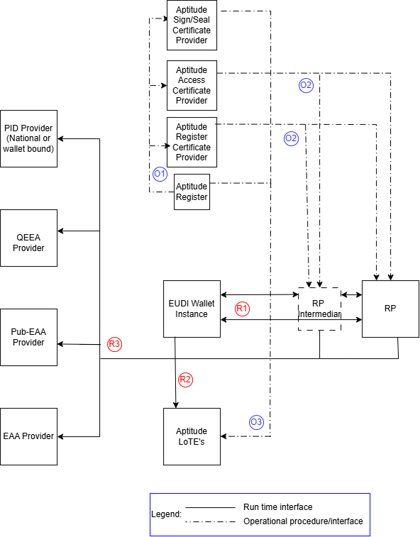
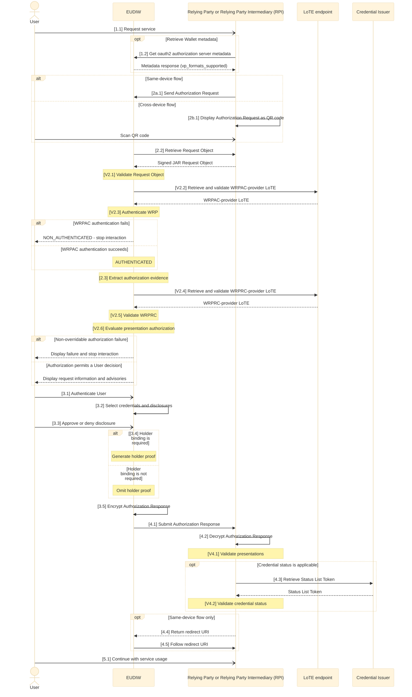

# Generic remote presentation flow specification

Version 0.91
Date 08-09-2026

## Authors

1. Aleksandar Simsic, ICTU
2. Nikos Triantafyllou, University of the Aegean
3. Andrea Moro, Fondazione Bruno Kessler

## Reviewers

1. Giancarlo Degani, Infocert
2. Luca Vallone, IPZS
3. ...

## Table of Contents

1. Introduction
2. Aptitude landscape overview
   * 2.1 Relation between different standards and interfaces
3. Interaction details
   * 3.1 Flow requirements
     * 3.1.1 OID4VP requirements
     * 3.1.2 HAIP requirements
     * 3.1.3 ETSI 119 472-2 requirements
     * 3.1.4 Additional Aptitude requirements
   * 3.2 Detailed technical flow description (sequence diagram)
     * 3.2.1 Steps mapping overview

## 1 Introduction

This document is a **non-normative companion** to the APTITUDE horizontal RFC specifications. It provides implementers with a single entry point for the generic credential remote presentation flow by:

* mapping the APTITUDE remote presentation flow end-to-end as a sequence diagram
* identifying which RFC section governs each step
* clarifying which interfaces and scenarios are in or out of scope for APTITUDE

It does not define new requirements — those are in the RFCs. In case of conflict between this document and an RFC, the RFC takes precedence.

## 2\. Aptitude landscape overview

Following diagram uses EUDI Wallet ecosystem roles diagram from [ARF 2.9](https://eudi.dev/2.9.0/architecture-and-reference-framework-main/#3-roles-within-the-eudi-wallet-ecosystem) as base and presents adaptations relevant for the remote presentation process within the Aptitude LSP.

.png)

Aptitude has several specifics on how the trust framework specific roles are filled in where it differs from the way that the related roles will finally being filled in within the full production setup in the Europe.

Here we are only clarifying which roles and/or interfaces are out of the scope of this flow specification:

| Interface | Description | Rationale |
|-----------|-------------|-----------|
| Wallet → APTITUDE Register (runtime) | Runtime lookup from Wallet to APTITUDE Register | Redundant: WRPRC is provisioned at onboarding time (design-time); registration certificate is becoming mandatory per 2025/848 IA.  *Note: A Wallet Instance MAY still use the Register APIs to:*<ul><li>*Check fresh Entity registration information as a backup to the WRPRC failure,*</li><li>*Check that the Registration certificate obtained by the WRP is bound to the service the Wallet Instance is interacting with.*</li></ul> |

### 2.1 Relation between different standards and interfaces

Following diagram uses Aptitude EUDI Wallet ecosystem diagram as a starting point, keeping in the picture just the roles that are relevant for the scope of this flow specification. It labels each interaction between the two roles and classifies each interface as a design time (blue label) or as a runtime (red label) interface.

In following table for each identified interface one or more of the relevant standards are listed. Further down within this flow specification these interfaces and related standards will be further used and referenced.

<table>
<colgroup>
<col style="width: 12%" />
<col style="width: 45%" />
<col style="width: 41%" />
</colgroup>
<thead>
<tr>
<th style="text-align: center;"><strong>Interface</strong></th>
<th style="text-align: center;"><strong>Applicable
standards</strong></th>
<th style="text-align: center;"><strong>Additional comment</strong></th>
</tr>
</thead>
<tbody>
<tr>
<td>O1</td>
<td><a
href="https://github.com/eu-digital-identity-wallet/eudi-doc-standards-and-technical-specifications/blob/main/docs/technical-specifications/ts6-common-set-of-rp-information-to-be-registered.md">TS6</a></td>
<td>Register party with its role (Relying Party and Relying Party Intermediary)</td>
</tr>
<tr>
<td>O2</td>
<td><a
href="https://www.etsi.org/deliver/etsi_ts/119400_119499/11941108/01.01.01_60/ts_11941108v010101p.pdf">ETSI
TS 119 411-8 ver1.1.1</a>, <a
href="https://www.etsi.org/deliver/etsi_ts/119400_119499/119475/01.02.01_60/ts_119475v010201p.pdf">ETSI
TS 119 475 ver1.2.1</a></td>
<td>Distribution of WRPACs &amp; WRPRCs</td>
</tr>
<tr>
<td>O3</td>
<td><a
href="https://github.com/eu-digital-identity-wallet/eudi-doc-standards-and-technical-specifications/blob/main/docs/technical-specifications/ts2-notification-publication-provider-information.md">TS2</a></td>
<td>Notifying TLP’s for related LoTE (Relying Parties, Providers of Access and Register Certificate)</td>
</tr>
<tr>
<td>R1</td>
<td>
<a
href="https://openid.net/specs/openid-4-verifiable-presentations-1_0.html">OID4VP ver1.0</a>,
<a
href="https://openid.net/specs/openid4vc-high-assurance-interoperability-profile-1_0-final.html">HAIP ver1.0</a>,
<a
href="https://www.etsi.org/deliver/etsi_ts/119400_119499/11947202/01.01.01_60/ts_11947202v010101p.pdf">ETSI
TS 119 472-2 ver1.1.1</a>,
<a
href="https://www.rfc-editor.org/info/rfc9101/">RFC 9101</a>

ISO18013-5, <a
href="https://datatracker.ietf.org/doc/draft-ietf-oauth-sd-jwt-vc/17/">SD-JWT
VC Draft 17</a>, <a
href="https://www.rfc-editor.org/info/rfc9901/">RFC9901 (SD-JWT)</a>, <a
href="https://www.etsi.org/deliver/etsi_ts/119400_119499/11947201/01.01.01_60/ts_11947201v010101p.pdf">ETSI
TS 119 472-1 ver1.1.1</a>
</td>
<td>VP and supporting standards</td>
</tr>
<tr>
<td>R2</td>
<td><a
href="https://www.etsi.org/deliver/etsi_ts/119600_119699/119602/01.01.01_60/ts_119602v010101p.pdf">ETSI
TS 119 602 ver1.1.1</a>, <a
href="https://www.etsi.org/deliver/etsi_ts/119600_119699/119612/02.04.01_60/ts_119612v020401p.pdf">ETSI
TS 119 612 ver2.4.1</a>, <a
href="https://github.com/APTITUDE-Consortium/aptitude-eudi-wallet-specs/blob/rfc003-trust/docs/horizontal-RFCs/RFC003.md#71-lote-endpoint">APTITUDE RFC003 LoTE Endpoint</a>, <a
href="https://aptitude-consortium.github.io/wp2-trust-specifications/latest/sections/trust-evaluation-process/#trust-anchor-validation-process">APTITUDE Trust Anchor Validation Process</a>, <a
href="https://aptitude-consortium.github.io/wp2-trust-specifications/latest/sections/trust-artifacts/#list-of-trusted-entities">APTITUDE List of Trusted Entities</a></td>
<td>Fetching the dedicated LoTEs for Providers of WRPACs and Providers of WRPRCs through the LoTE endpoint</td>
</tr>
<tr>
<td>R3</td>
<td><a
href="https://aptitude-consortium.github.io/wp2-trust-specifications/latest/sections/trust-management-lifecycle/">APTITUDE Trust management and lifecycle</a>, <a
href="https://datatracker.ietf.org/doc/draft-ietf-oauth-status-list/21/">IETF Token Status List Draft 21</a></td>
<td>Runtime status processing for WRPACs, WRPRCs, and returned digital credentials (PID, QEAA, EAA, and PuB-EAA) follows <a href="../horizontal-RFCs/RFC004.md">RFC004</a>.</td>
</tr>
</tbody>
</table>

The process behind O1, O2 and O3 is further explained in the [APTITUDE onboarding process](https://aptitude-consortium.github.io/wp2-trust-specifications/latest/sections/onboarding-process/).

## 3\. Interaction details

In this section, the generic remote presentation flow is further detailed by identifying the exact API, message, or other mechanism that takes place at each step.
After the diagram each step is then linked to the underlying RFC that provides more details on it’s usage.

### 3.1 Flow requirements

Here is the overview of the requirements taken from identified standard specifications that do have impact on flow diagram provided within this document.

#### 3.1.1 OID4VP requirements

In follow up table the requirements relevant for the flow are listed with decision if it is in the scope or not of this version of the Aptitude presentation flow specification.

|**Requirement**|**Scope decision**|**Comment**|
|-|-|-|
|Same-device and cross-device flow|Partially in scope|Same-device and cross-device presentation are supported for `eu-eaap`, `haip-vp`, and `openid4vp`. In this RFC version, `mdoc-openid4vp` supports same-device remote presentation only.|
|Browser mediation API (Digital Credential API) usage in cross-device flow|Not in the scope | To introduce it as optional within the ver 1.1|
|Response with VP Token through browser redirect or HTTP POST request|Partially in scope | Only HTTP Post shall be used, as mandated by HAIP|
|RO (Request Object) shall be retrieved as JAR, as per [RFC9101](https://www.rfc-editor.org/info/rfc9101/)|In scope|For this applied HAIP/ETSI flow, the signed JAR Request Object is passed by reference using `request_uri` in same-device and cross-device flows. Its JOSE header has `typ` set to `oauth-authz-req+jwt`, and `client_id` uses the `x509_hash` prefix. The Wallet checks the audience, nonce, validity period, signature, and applicable `x5c` restrictions. These are profile choices for this flow, not baseline RFC002 trust-governance rules.|
|Verifier and wallet may support using of request_uri_method=post, allowing wallet to pass its technical capabilities when requesting RO|Not in the scope|Only the value of get is supported|
|Support for verifiable presentations and for low-security credentials (without holder binding)|In scope|Impact on the validation steps by verifier
|response_type=vp_token parameter, combined with parameters response_uri and response_mode, that can have values of direct_post or direct_post.jwt is recommended to use within the RO|Partially in scope|This applied HAIP/ETSI flow uses `response_mode=direct_post.jwt`. The encrypted response uses verifier response-encryption key material supplied in `client_metadata`; the verifier provides fresh key material for each request.|
|Protocol supports broad range of client_id_prefix schemes|Partially in the scope|Subsequent profiles are limiting prefixes use. Retrieval of the verifier metadata depends on the prefix value, hence listing requirements as relevant for the flow|
|Support for `trusted_authorities` attribute usage within the credential query|In scope|The request parameter is optional, but implementations support processing `trusted_authorities.type` with value `etsi_tl` for the applied flow. Each `trusted_authority.values` value is the URI referencing the expected LoTE which contains the Trust Anchor of the Sign/Seal certificate which signed the credential.|
|Wallet should offer its metadata through the Authorization Server Metadata endpoint, as defined by [RFC8414](https://www.rfc-editor.org/info/rfc8414/)|In scope|Optional usage by the Verifier|
|transaction_data attribute usage|In scope|Required for payments use cases by WP6|

#### 3.1.2 HAIP requirements

Comparing to the OID4VP the HAIP requirements are stricter on what must
be implemented versus what may be implemented. In the following table
the requirements impacting presentation flow are listed.

|**Requirement**|**Scope decision**|**Comment**|
|-|-|-|
|The response type shall be vp_token|In scope|It rules out other options from OID4VP|
|Signed JAR Request Object by reference|In scope|The applied profile uses `request_uri`, JOSE `typ=oauth-authz-req+jwt`, `client_id` with the `x509_hash` prefix, and validation of `aud`, `nonce`, validity, signature, and applicable `x5c` restrictions.|
|Encrypted Authorization Response|In scope|The applied profile uses `response_mode=direct_post.jwt`. The response is encrypted with verifier key material from `client_metadata`; the verifier provides fresh key material for each request and supports the applicable HAIP algorithms.|
|`etsi_tl`-based `trusted_authorities` support|In scope|Support is required for the applied HAIP flow, although the optional parameter need not occur in every request. APTITUDE entities use their applicable dedicated LoTE.|
|Wallet shall support using of browers mediation API|Not in scope|To introduce it as optional within the ver 1.1|

#### 3.1.3 ETSI 119 472-2 requirements

ETSI profile is delivered on top of HAIP profile to clarify all the
specifics for the EUDI wallet implementation. It includes clarifications
on how different trust and policy checks should take place, something
that is also referenced later within the generic technical flow
(sequence diagram). Follow up table includes therefore requirements
impacting presentation flow and designed validation checks.

|**Requirement**|**Scope decision**|**Comment**|
|-|-|-|
|Wallet unit shall support custom URL scheme `eu-eaap://`; other schemes may be supported as well|In scope||
|Authorization request shall use client identifier prefix value of `x509_hash`|In scope|Aligned with HAIP requirement|
|Authorization request shall contain the `request_uri` parameter|In scope|The selected flow passes a signed JAR Request Object by reference, aligned with HAIP.|
|The value of the `response_mode` parameter within the RO shall be `direct_post.jwt`|In scope|The response is encrypted using the verifier's fresh per-request key from `client_metadata`, aligned with HAIP.|
|WRPRC shall be provided through the `verifier_info` parameter within the RO|In scope|`verifier_info` also carries the RPRC_19a context used for authorization and Register fallback.|
|Verifier shall provide public key material within the `client_metadata` parameter of the RO|In scope|The Wallet uses this fresh per-request key material to encrypt the response.|
|Verifier shall provide `nonce` and `state` values within the RO|In scope|The values are used for request, response, and session correlation as applicable.|
|`etsi_tl`-based trusted-authority processing for DCQL|In scope|The Wallet matches each `etsi_tl` to the LOTE URL which harvors the Trust Anchor of the Sign/Seal certificate signing the credential being requested.|
|Verifier signs the Request Object within the JAR using the private key corresponding to its WRPAC|In scope|The WRPAC chain is provided through the JAR `x5c` header, and the Wallet validates that signature as the interaction signature after validating the chain.|

#### 3.1.4 Additional Aptitude requirements

In some cases to simplify implementation for the partners there are number of additional requirements added on the top of all formal standards and specifications

|**Requirement**|**Scope decision**|
|-|-|

### 3.2 Detailed technical flow description (sequence diagram)

The end-to-end remote presentation flow is presented in a sequence diagram (SD), after which each step is linked to the relevant APTITUDE profile specification or supporting standard. Referenced specifications are:

* [Aptitude Presentation profile RFC-02](https://github.com/APTITUDE-Consortium/aptitude-eudi-wallet-specs/blob/main/docs/horizontal-RFCs/RFC002.md)
* [Aptitude Trust Evaluation RFC-03](https://github.com/APTITUDE-Consortium/aptitude-eudi-wallet-specs/blob/rfc003-trust/docs/horizontal-RFCs/RFC003.md)
* [Aptitude Trust Revocation RFC-04](https://github.com/APTITUDE-Consortium/aptitude-eudi-wallet-specs/blob/main/docs/horizontal-RFCs/RFC004.md)
* [Aptitude trust framework](https://aptitude-consortium.github.io/wp2-trust-specifications/latest/)

### 3.2.1 Steps mapping overview

| SD step | API/message or process | Step description and references |
| --- | --- | --- |
| 1.1 | Request service | The User starts a service interaction with the RP or RPI. |
| 1.2 | Request Wallet metadata | Optionally retrieve the Wallet metadata and supported presentation formats. See [OpenID4VP 1.0](https://openid.net/specs/openid-4-verifiable-presentations-1_0.html). |
| 2a.1 | Send same-device Authorization Request | Invoke the Wallet using `request_uri`, `client_id`, and the applicable `request_uri_method`. Supported custom URI schemes are `eu-eaap://`, `haip-vp://`, `openid4vp://`, and `mdoc-openid4vp://`. See [RFC002 §6.1.2 and §8.1](../horizontal-RFCs/RFC002.md#612-wallet-invocation). |
| 2b.1 | Display cross-device Authorization Request | Encode the Authorization Request reference in a QR code for scanning by the Wallet. This RFC version does not use `mdoc-openid4vp` for cross-device presentation. See [RFC002 §6.2](../horizontal-RFCs/RFC002.md#62-cross-device-presentation-flow-non-api-mediated). |
| 2.2 | Retrieve Request Object | Retrieve the signed JAR Request Object by reference from `request_uri`. See [RFC002 §8.2](../horizontal-RFCs/RFC002.md#82-presentation-request-interface). |
| V2.1 | Validate Request Object | Parse the Request Object and validate the applicable profile requirements for `typ`, `client_id` with `x509_hash`, `aud`, `nonce`, validity, `response_type`, `response_mode`, `response_uri`, `client_metadata`, `dcql_query`, `state`, `verifier_info`, and `x5c`. Cryptographic WRP authentication is completed in V2.3. See [OpenID4VP §5, §5.1](https://openid.net/specs/openid-4-verifiable-presentations-1_0.html#name-request-object-validation), [HAIP §5.1](https://openid.net/specs/openid4vc-high-assurance-interoperability-profile-1_0-final.html), [RFC9101](https://www.rfc-editor.org/info/rfc9101), and [RFC002 §8.2.2 and §8.2.4](../horizontal-RFCs/RFC002.md#822-etsi-aligned-request-object-requirements). |
| V2.2 | Validate WRPAC-provider LoTE | Retrieve the dedicated WRPAC-provider LoTE through the common LoTE endpoint, validate the LoTE, and extract the applicable WRPAC Trust Anchor before certificate-path validation. See the [RFC003 LoTE Endpoint](https://github.com/APTITUDE-Consortium/aptitude-eudi-wallet-specs/blob/rfc003-trust/docs/horizontal-RFCs/RFC003.md#71-lote-endpoint), [Trust Anchor Validation Process](https://aptitude-consortium.github.io/wp2-trust-specifications/latest/sections/trust-evaluation-process/#trust-anchor-validation-process), and [LoTE Validation Process](https://aptitude-consortium.github.io/wp2-trust-specifications/latest/sections/trust-evaluation-process/#list-of-trusted-entities-validation-process). |
| V2.3 | Authenticate WRP | Validate the WRPAC path at the current time using RFC 5280, check certificate status through the applicable RFC004 CRL or OCSP mechanism, verify the Request Object signature with the validated WRPAC leaf key, and verify `x509_hash`, `typ`, audience, nonce, validity, and applicable HAIP `x5c` restrictions. The result is `AUTHENTICATED` or blocking `NON_AUTHENTICATED`. See the [Authentication Process](https://aptitude-consortium.github.io/wp2-trust-specifications/latest/sections/trust-evaluation-process/#authentication-process), [WRPAC](https://aptitude-consortium.github.io/wp2-trust-specifications/latest/sections/trust-artifacts/#wallet-relying-party-access-certificate), [X.509 Certificate Chain Validation](https://aptitude-consortium.github.io/wp2-trust-specifications/latest/sections/trust-evaluation-process/#certificate-path-validation), and [RFC004 §6.1, 7.1, and §7.2](../horizontal-RFCs/RFC004.md#61-wallet-solution-requirements). |
| 2.3 | Extract authorization evidence | Extract the remote WRPRC and RPRC_19a presentation context from `verifier_info`. See [Authorization Evidences and Distribution Methods](https://aptitude-consortium.github.io/wp2-trust-specifications/latest/sections/trust-evaluation-process/#authorization-evidences) and [RFC002 §8.2.2](../horizontal-RFCs/RFC002.md#822-etsi-aligned-request-object-requirements). |
| V2.4 | Validate WRPRC-provider LoTE | Retrieve the dedicated WRPRC-provider LoTE through the same LoTE endpoint used in V2.2, validate the LoTE, and extract the applicable WRPRC Trust Anchor. See the [RFC003 LoTE Endpoint](https://github.com/APTITUDE-Consortium/aptitude-eudi-wallet-specs/blob/rfc003-trust/docs/horizontal-RFCs/RFC003.md#71-lote-endpoint) and [Trust Anchor Validation Process](https://aptitude-consortium.github.io/wp2-trust-specifications/latest/sections/trust-evaluation-process/#trust-anchor-validation-process). |
| V2.5 | Validate WRPRC | Validate the remote WRPRC format and `typ=rc-wrp+jwt`, accepted algorithm, signature, certificate path, `iat` and `exp`, status, subject/context coherence, and intermediary data. See the [WRPRC Validation Procedure](https://aptitude-consortium.github.io/wp2-trust-specifications/latest/sections/trust-evaluation-process/#wrprc-validation-procedure), [WRPRC](https://aptitude-consortium.github.io/wp2-trust-specifications/latest/sections/trust-artifacts/#wallet-relying-party-registration-certificate), [X.509 validation](https://aptitude-consortium.github.io/wp2-trust-specifications/latest/sections/trust-evaluation-process/#certificate-path-validation), and [RFC004 §6.3, 7.3, and §10.1.3](../horizontal-RFCs/RFC004.md#63-provider-of-wrprc-requirements). |
| V2.6 | Evaluate presentation authorization | Apply direct or intermediary binding, `Service_Provider` entitlement, user-optional exact and case-sensitive scope comparison, and EDP evaluation for every matching attestation. Use final-RP context for an intermediated request. Display the final RP identity, requested attributes, intended use, privacy policy, and advisories. Binding and intermediary failures are non-overridable; the other presentation outcomes follow the authorization override rules. See [Authorization During Presentation](https://aptitude-consortium.github.io/wp2-trust-specifications/latest/sections/trust-evaluation-process/#authorization-during-presentation), [binding](https://aptitude-consortium.github.io/wp2-trust-specifications/latest/sections/trust-evaluation-process/#binding-verification-procedure), [entitlement](https://aptitude-consortium.github.io/wp2-trust-specifications/latest/sections/trust-evaluation-process/#entitlement-verification-procedure), [scope](https://aptitude-consortium.github.io/wp2-trust-specifications/latest/sections/trust-evaluation-process/#scope-comparison-procedure-presentation-only-user-optional), [EDP](https://aptitude-consortium.github.io/wp2-trust-specifications/latest/sections/trust-evaluation-process/#edp-evaluation-procedure). |
| 3.1 | Authenticate User | Authenticate the User locally before allowing credential disclosure. See [RFC002 same-device](../horizontal-RFCs/RFC002.md#61-same-device-presentation-flow) and [cross-device](../horizontal-RFCs/RFC002.md#62-cross-device-presentation-flow-non-api-mediated) presentation flows. |
| 3.2 | Select credentials and disclosures | Select credentials and disclosures that satisfy `dcql_query`. Where applicable, include `transaction_data` in the information presented for User consent. See [RFC002 §6.1.5](../horizontal-RFCs/RFC002.md#615-presentation-generation) and [OpenID4VP DCQL processing](https://openid.net/specs/openid-4-verifiable-presentations-1_0.html). |
| 3.3 | Approve or deny disclosure | Ask the User to approve or deny disclosure after displaying the final RP and the authorization information and advisories produced by V2.6. See the [Authorization Process User approval steps](https://aptitude-consortium.github.io/wp2-trust-specifications/latest/sections/trust-evaluation-process/#authorization-during-presentation). |
| 3.4 | Generate or omit holder proof | For SD-JWT VC, generate a KB-JWT bound to the request nonce and audience when holder binding is required. For `mso_mdoc`, generate the `DeviceResponse` and `DeviceAuth` using the reconstructed `SessionTranscript` when `mdoc-openid4vp` applies. If holder binding is not required, omit the proof while retaining request/response correlation and anti-replay validation. See [RFC9901 §4.3](https://www.rfc-editor.org/rfc/rfc9901.html#section-4.3), [RFC002 §5.6, §7.2, §8.2.3.1, §8.2.5, and §8.3.3.1](../horizontal-RFCs/RFC002.md#56-mdoc-openid4vp-profile), and the [HAIP format rules](https://openid.net/specs/openid4vc-high-assurance-interoperability-profile-1_0-final.html#name-openid4vc-credential-format). |
| 3.5 | Encrypt Authorization Response | Encrypt the response as JWE using the verifier's fresh per-request key from `client_metadata` and the applicable `alg`, `enc`, and `kid`. For HAIP, use ECDH-ES with P-256 and support the applicable `A128GCM` and `A256GCM` content-encryption algorithms. See [RFC002 §8.3.2](../horizontal-RFCs/RFC002.md#832-etsi-aligned-response-protection), [OpenID4VP §8.3](https://openid.net/specs/openid-4-verifiable-presentations-1_0.html#name-response), and [HAIP §§5.1.2.3, 5.2.5, and 5.2.6](https://openid.net/specs/openid4vc-high-assurance-interoperability-profile-1_0-final.html). |
| 4.1 | Submit Authorization Response | Send an HTTP POST using `response_mode=direct_post.jwt`, with the encrypted JWE in the `response` parameter. See [RFC002 §8.3](../horizontal-RFCs/RFC002.md#83-presentation-response-interface) and [OpenID4VP `direct_post.jwt`](https://openid.net/specs/openid-4-verifiable-presentations-1_0.html#name-response-mode-direct_postjw). |
| 4.2 | Decrypt Authorization Response | Decrypt the JWE using the verifier's corresponding per-request private key before validating the enclosed response and presentations. See [RFC002 §8.3.2](../horizontal-RFCs/RFC002.md#832-etsi-aligned-response-protection) and [OpenID4VP encrypted responses](https://openid.net/specs/openid-4-verifiable-presentations-1_0.html#name-encrypted-responses). |
| V4.1 | Validate presentations | Validate request/session correlation and `state` where applicable, nonce and audience/client binding, response and proof integrity, credential or attestation signatures and Sign/Seal chains, requested disclosures and claim constraints, and format-specific holder binding. For mdoc, validate `DeviceResponse`, document type, namespaces and elements, handover, `DeviceAuth`, and the reconstructed `SessionTranscript`. Reject invalid presentations before relying on them. See [RFC002 §7.2 and §8.3.3.1 and APT-PRES-VER-08 through -12](../horizontal-RFCs/RFC002.md#72-verifier-requirements), [OpenID4VP §8](https://openid.net/specs/openid-4-verifiable-presentations-1_0.html), [HAIP §5](https://openid.net/specs/openid4vc-high-assurance-interoperability-profile-1_0-final.html), and the [Sign/Seal Validation Process](https://aptitude-consortium.github.io/wp2-trust-specifications/latest/sections/trust-evaluation-process/#signseal-validation-process). |
| 4.3 | Retrieve Status List Token | For each returned credential with an applicable status reference, retrieve the Status List Token from the Credential Issuer. See the [APTITUDE Trust Management and Lifecycle](https://aptitude-consortium.github.io/wp2-trust-specifications/latest/sections/trust-management-lifecycle/) and [RFC004 §7.3](../horizontal-RFCs/RFC004.md#73-tsl-endpoint). |
| V4.2 | Validate credential status | Validate the referenced artifact and status reference, SLT signature and trust, subject URI binding, `iat`, `exp`, and `ttl`, decompression, index bounds, and profile-specific status mapping. Accept `VALID`, reject `INVALID`, and apply issuer policy to `SUSPENDED`. See [RFC004 §§6.1, 10.1.2, 10.1.3, 10.1.4, and TSL-VAL-01 through -08](../horizontal-RFCs/RFC004.md#1012-token-status-list-digital-credentials-profile). |
| 4.4 | Return same-device redirect URI | After the response POST in a same-device flow, return `redirect_uri` to the Wallet. This step does not apply to cross-device presentation. See [OpenID4VP §8.2](https://openid.net/specs/openid-4-verifiable-presentations-1_0.html#name-response-mode-direct_post) and [HAIP §5.1](https://openid.net/specs/openid4vc-high-assurance-interoperability-profile-1_0-final.html). |
| 4.5 | Follow same-device redirect URI | Follow `redirect_uri` in the same session. The Verifier rejects a missing redirect or one associated with a different session. See [HAIP §5.1](https://openid.net/specs/openid4vc-high-assurance-interoperability-profile-1_0-final.html) and the [OpenID4VP session-fixation considerations](https://openid.net/specs/openid-4-verifiable-presentations-1_0.html#name-session-fixation). |
| 5.1 | Continue service usage | Continue the RP service only after successful presentation processing and, for same-device presentation, successful redirect completion. See [RFC002 §6.1.7](../horizontal-RFCs/RFC002.md#617-result-handling). |
