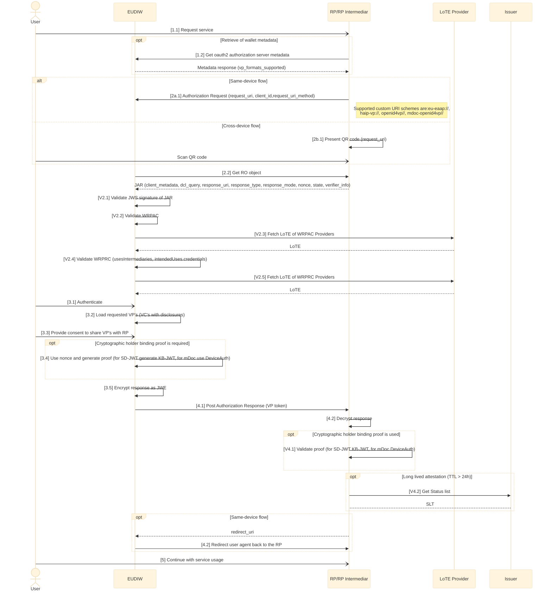

# Generic issuance flow specification

Version 0.8
Date 07-09-2026

## Authors

1. Aleksandar Simsic, ICTU
2. Nikos Triantafyllou, University of the Aegean
3. Andrea Moro, Fondazione Bruno Kessler

## Reviewers

1. Giancarlo Degani, Infocert
2. Luca Vallone, IPZS
3. ...

## Table of Contents

1. Introduction
2. Aptitude landscape overview
   * 2.1 Relation between different standards and interfaces
3. Interaction details
   * 3.1 Flow requirements
     * 3.1.1 OID4VP requirements
     * 3.1.2 HAIP requirements
     * 3.1.3 ETSI 119 472-2 requirements
     * 3.1.4 Additional Aptitude requirements
   * 3.2 Detailed technical flow description (sequence diagram)
     * 3.2.1 Steps mapping overview

## 1 Introduction

This document is a **non-normative companion** to the APTITUDE horizontal RFC specifications. It provides implementers with a single entry point for the generic credential remote presentation flow by:

* mapping the APTITUDE remote presentation flow end-to-end as a sequence diagram
* identifying which RFC section governs each step
* clarifying which interfaces and scenarios are in or out of scope for APTITUDE

It does not define new requirements — those are in the RFCs. In case of conflict between this document and an RFC, the RFC takes precedence.

## 2\. Aptitude landscape overview

Following diagram uses EUDI Wallet ecosystem roles diagram from [ARF 2.9](https://eudi.dev/2.9.0/architecture-and-reference-framework-main/#3-roles-within-the-eudi-wallet-ecosystem) as base and presents adaptations relevant for the remote presentation process within the Aptitude LSP.

.png)

Aptitude has several specifics on how the trust framework specific roles are filled in where it differs from the way that the related roles will finally being filled in within the full production setup in the Europe.

Here we are only clarifying which roles and/or interfaces are out of the scope of this flow specification:

| Interface | Description | Rationale |
|-----------|-------------|-----------|
| Wallet → APTITUDE Register (runtime) | Runtime lookup from Wallet to APTITUDE Register | Redundant: WRPRC is provisioned at onboarding time (design-time); registration certificate is becoming mandatory per 2025/848 IA.  *Note: A Wallet Instance MAY still use the Register APIs to:*<ul><li>*Check fresh Entity registration information as a backup to the WRPRC failure,*</li><li>*Check that the Registration certificate obtained by the WRP is bound to the service the Wallet Instance is interacting with.*</li></ul> |

### 2.1 Relation between different standards and interfaces

Following diagram uses Aptitude EUDI Wallet ecosystem diagram as a starting point, keeping in the picture just the roles that are relevant for the scope of this flow specification. It labels each interaction between the two roles and classifies each interface as a design time (blue label) or as a runtime (red label) interface.

In following table for each identified interface one or more of the relevant standards are listed. Further down within this flow specification these interfaces and related standards will be further used and referenced.

<table>
<colgroup>
<col style="width: 12%" />
<col style="width: 45%" />
<col style="width: 41%" />
</colgroup>
<thead>
<tr>
<th style="text-align: center;"><strong>Interface</strong></th>
<th style="text-align: center;"><strong>Applicable
standards</strong></th>
<th style="text-align: center;"><strong>Additional comment</strong></th>
</tr>
</thead>
<tbody>
<tr>
<td>O1</td>
<td><a
href="https://github.com/eu-digital-identity-wallet/eudi-doc-standards-and-technical-specifications/blob/main/docs/technical-specifications/ts6-common-set-of-rp-information-to-be-registered.md">TS6</a></td>
<td>Register party with its role (Relying Party and Intermediar Relying Party)</td>
</tr>
<tr>
<td>O2</td>
<td><a
href="https://www.etsi.org/deliver/etsi_ts/119400_119499/11941108/01.01.01_60/ts_11941108v010101p.pdf">ETSI
TS 119 411-8 ver1.1.1</a>, <a
href="https://www.etsi.org/deliver/etsi_ts/119400_119499/119475/01.02.01_60/ts_119475v010201p.pdf">ETSI
TS 119 475 ver1.2.1</a></td>
<td>Distribution of WRPASs &amp; WRPRCs</td>
</tr>
<tr>
<td>O3</td>
<td><a
href="https://github.com/eu-digital-identity-wallet/eudi-doc-standards-and-technical-specifications/blob/main/docs/technical-specifications/ts2-notification-publication-provider-information.md">TS2</a></td>
<td>Notifying TLP’s for related LoTE (Relying Parties, Providers of Access and Register Certificate)</td>
</tr>
<tr>
<td>R1</td>
<td>
<a
href="https://openid.net/specs/openid-4-verifiable-presentations-1_0.html">OID4VP ver1.0</a>,
<a
href="https://openid.net/specs/openid4vc-high-assurance-interoperability-profile-1_0-final.html">HAIP ver1.0</a>,
<a
href="https://www.etsi.org/deliver/etsi_ts/119400_119499/11947202/01.01.01_60/ts_11947202v010101p.pdf">ETSI
TS 119 472-2 ver1.1.1</a>,
<a
href="https://www.rfc-editor.org/info/rfc9101/">RFC 9101</a>

ISO18013-5, <a
href="https://datatracker.ietf.org/doc/draft-ietf-oauth-sd-jwt-vc/17/">SD-JWT
VC Draft 17</a>, <a
href="https://www.etsi.org/deliver/etsi_ts/119400_119499/11947201/01.01.01_60/ts_11947201v010101p.pdf">ETSI
TS 119 472-1 ver1.1.1</a>
</td>
<td>VP and supporting standards</td>
</tr>
<tr>
<td>R2</td>
<td><a
href="https://www.etsi.org/deliver/etsi_ts/119600_119699/119602/01.01.01_60/ts_119602v010101p.pdf">ETSI
TS 119 602 ver1.1.1</a>, <a
href="https://www.etsi.org/deliver/etsi_ts/119600_119699/119612/02.04.01_60/ts_119612v020401p.pdf">ETSI
TS 119 612 ver2.4.1</a></td>
<td>Fetching RP LoTE</td>
</tr>
<tr>
<td>R3</td>
<td><a
href="https://aptitude-consortium.github.io/wp2-trust-specifications/latest/sections/trust-management-lifecycle/">APTITUDE Trust management and lifecycle</a>, <a
href="https://datatracker.ietf.org/doc/draft-ietf-oauth-status-list/21/">IETF Token Status List Draft 21</a></td>
<td>Runtime status list checks on PID/(Q)EAA; the checks are to be profiled precisely in <a href="../horizontal-RFCs/RFC004.md">RFC004</a>.</td>
</tr>
</tbody>
</table>

The process behind O1, O2 and O3 is further explained in Apptitude on-boarding document, please look here <
[wp2-trust-specifications/docs/topics/onboarding-process.md at main · APTITUDE-Consortium/wp2-trust-specifications](https://github.com/APTITUDE-Consortium/wp2-trust-specifications/blob/main/docs/topics/onboarding-process.md)> for more details.

## 3\. Interaction details

In this section generic issuance flow is further detailed by identifying exact API/message or other mechanism that takes place at each step.
After the diagram each step is then linked to the underlying RFC that provides more details on it’s usage.

### 3.1 Flow requirements

Here is the overview of the requirements taken from identified standard specifications that do have impact on flow diagram provided within this document.

#### 3.1.1 OID4VP requirements

In follow up table the requirements relevant for the flow are listed with decision if it is in the scope or not of this version of the Aptitude presentation flow specification.

|**Requirement**|**Scope decision**|**Comment**|
|-|-|-|
|Same-device and cross-device flow|In scope|
|Browser mediation API (Digital Credential API) usage in cross-device flow|Not in the scope|To introduce it as optional within the ver 1.1|
|Response with VP Token through browser redirect or HTTP POST request|Partially in scope|Only HTTP Post shall be used|
|RO (Request Object) shall be retrieved as JAR, as per [RFC9101](https://www.rfc-editor.org/info/rfc9101/)|In scope|It shall be used by both same-device and cross-device flow. Verifier is passing reference to the RO, wallet is retrieving it|
|Verifier and wallet may support using of request_uri_method=post, allowing wallet to pass its technical capabilities when requesting RO|Not in the scope|Only the value of get is supported|
|Support for verifiable presentations and for low-security credentials (without holder binding)|In scope|Impact on the validation steps by verifier
|response_type=vp_token parameter, combined with parameters response_uri and response_mode, that can have values of direct_post or direct_post.jwt is recommended to use within the RO|In scope
|Protocol supports broad range of client_id_prefix schemes|Partially in the scope|Subsequent profiles are limiting prefixes use. Retrieval of the verifier metadata depends on the prefix value, hence listing requirements as relevant for the flow|
|Support for trusted_authorities attribute usage within the credential query|In scope|Impacts (trust) validation of issuer of the credential, otional usage|
|Wallet should offer its metadata through the Authorization Server Metadata endpoint, as defined by [RFC8414](https://www.rfc-editor.org/info/rfc8414/)|In scope|Optional usage by the Verifier|
|Requirements on transaction_data usage?||<mark>To validate with WP6?</mark>|

#### 3.1.2 HAIP requirements

Comparing to the OID4VP the HAIP requirements are stricter on what must
be implemented versus what may be implemented. In the following table
the requirements impacting presentation flow are listed.

|**Requirement**|**Scope decision**|**Comment**|
|-|-|-|
|The response type shall be vp_token|In scope|It rules out other options from OID4VP|
|JAR must be accompanied by the using of x509_hash as client_id_prefix|In scope|It influences wallet validation steps|
|VP token response shall be encrypted, verifiers are providing publick key via client_metadata within the RO|In scope|It mandates using of direct_post.jwt value for the response_mode
|aki based usage of trusted_authorities shall be supported (see related requirement from OID4VP from the previous section)|In scope| <mark>Do we need this within the Aptitude for any of the WP's?</mark>|
|Wallet shall support using of browers mediation API|Not in scope|To introduce it as optional within the ver 1.1|

#### 3.1.3 ETSI 119 472-2 requirements

ETSI profile is delivered on top of HAIP profile to clarify all the
specifics for the EUDI wallet implementation. It includes clarifications
on how different trust and policy checks should take place, something
that is also referenced later within the generic technical flow
(sequence diagram). Follow up table includes therefore requirements
impacting presentation flow and designed validation checks.

|**Requirement**|**Scope decision**|**Comment**|
|-|-|-|
|Wallet unit shall support custom URL scheme eu-eaap://, others schemes may be supported as well|In scope||
|Authorization request shall use client identifier prefix value of x509_hash|In scope|Alligned with HAIP requirement|
|Authorization request shall contain the request_uri parameter|In scope|Alligned with HAIP requirement|
|The value of response_mode parameter within the RO shall be direct_post.jwt|In scope|Alligned with HAIP requirement|
|WRPRC shall be provided through verifier_info parameter within the RO|In scope||
|Verifier shall provide public key (that wallet will use to encrypt VP token) within the client_metadata parameter of the RO|In scope|Alligned with HAIP requirement|
|Verifier shall provide nonce and state value within the RO|In scope|It influences verifier validation process|
|aki based trusted authority for DCQL shall use ETSI trusted list mechanisam|In scope|It further profiles this use comparing to the HAIP requirement.<mark>See question under comment on the HAIP requirement</mark>|
|Verifier will sign RO within the JAR using private key corresponding to the public key of WRPAC, provided through x5c parameter of JAR the header|In scope||

#### 3.1.5 Additional Aptitude requirements

In some cases to simplify implementation for the partners there are number of additional requirements added on the top of all formal standards and specifications

|**Requirement**|**Scope decision**|
|-|-|

### 3.2 Detailed technical flow description (sequence diagram)

E2E issuance flow is presented through sequence diagram (SD) and after that each step is linked to the relevant Aptitude profile specification document. Referenced specs are:

* [Aptitude Presentation profile RFC-02](https://github.com/APTITUDE-Consortium/aptitude-eudi-wallet-specs/blob/main/docs/horizontal-RFCs/RFC002.md)
* [Aptitude Trust Evaluation RFC-03](https://github.com/APTITUDE-Consortium/aptitude-eudi-wallet-specs/blob/rfc003-trust/docs/horizontal-RFCs/RFC003.md)
* [Aptitude Trust Evaluation RFC-04](https://github.com/APTITUDE-Consortium/aptitude-eudi-wallet-specs/blob/main/docs/horizontal-RFCs/RFC004.md)
* [Aptitude trust framework](https://aptitude-consortium.github.io/wp2-trust-specifications/latest/trust-framework/)
* ....

### 3.2.1 Steps mapping overview

<table>
<colgroup>
<col style="width: 26%" />
<col style="width: 31%" />
<col style="width: 25%" />
<col style="width: 16%" />
</colgroup>
<thead>
<tr>
<th style="text-align: center;"><strong>SD step number</strong></th>
<th style="text-align: center;"><strong>API/message</strong></th>
<th style="text-align: center;"><strong>More info</strong></th>
<th style="text-align: center;"><strong>Comment</strong></th>
</tr>
</thead>
<tbody>
<tr>
<td>1.2</td>
<td>Request wallet metadata</td>
<td></td>
<td></td>
</tr>
<tr>
<td>2a.1</td>
<td> Authorization Request</td>
<td>
<a
href="https://github.com/APTITUDE-Consortium/aptitude-eudi-wallet-specs/blob/main/docs/horizontal-RFCs/RFC002.md#612-wallet-invocation">RFC-02
6.1.2</a>

<a
href="https://github.com/APTITUDE-Consortium/aptitude-eudi-wallet-specs/blob/main/docs/horizontal-RFCs/RFC002.md#81-wallet-invocation-interface">RFC-02
8.1</a>

<td></td>
</tr>
<tr>
<td>2.2</td>
<td>Get JAR object</td>
<td><a
href="https://github.com/APTITUDE-Consortium/aptitude-eudi-wallet-specs/blob/main/docs/horizontal-RFCs/RFC002.md#82-presentation-request-interface">RFC-02 8.2</a></td>
</tr>
<tr>
<td>V2.1</td>
<td>Validate JWS signature of JAR</td>
<td></td>
<td></td>
</tr>
<tr>
<td>V2.2</td>
<td>Validate WRPAC</td>
<td>
<a
href="https://github.com/APTITUDE-Consortium/wp2-trust-specifications/blob/main/docs/topics/access-certificate.md">Aptitude
WRPAC</a>

<a
href="https://aptitude-consortium.github.io/wp2-trust-specifications/latest/sections/trust-evaluation-process/#authentication-process">Authentication Process</a>
</td>
<td></td>
</tr>
<tr>
<td>V2.3</td>
<td>Get LoTE</td>
<td>
<a
href="https://github.com/APTITUDE-Consortium/aptitude-eudi-wallet-specs/blob/rfc003-trust/docs/horizontal-RFCs/RFC003.md#71-lote-endpoint">RFC003
LoTE Endpoint</a>

<a
href="https://aptitude-consortium.github.io/wp2-trust-specifications/latest/sections/trust-evaluation-process/#list-of-trusted-entities-validation-process">LoTE Validation Process</a>
</td>
<td></td>
</tr>
<tr>
<td>V2.4</td>
<td>Validate WRPRC</td>
<td><a
href="https://github.com/APTITUDE-Consortium/wp2-trust-specifications/blob/main/docs/topics/registration-certificate.md">Aptitude
WRPRC</a></td>
<td></td>
</tr>
<tr>
<td>3.4</td>
<td>Generate holder binding proof</td>
<td></td>
<td></td>
</tr>
<tr>
<td>3.5</td>
<td>Encrypt response as JWE</td>
<td></td>
<td></td>
</tr>
<tr>
<td>4.1</td>
<td>Post Authorization Response</td>
<td><a
href="https://github.com/APTITUDE-Consortium/aptitude-eudi-wallet-specs/blob/main/docs/horizontal-RFCs/RFC002.md#83-presentation-response-interface">RFC-02 8.3</a></td>
<td></td>
</tr>
<tr>
<td>4.2</td>
<td>Decrypt response</td>
<td></td>
<td></td>
</tr>
<tr>
<td>V4.1</td>
<td>Validate holder binding proof</td>
<td></td>
<td></td>
</tr>
<tr>
<td>V4.2</td>
<td>Get Status list</td>
<td>
  
<a href="https://aptitude-consortium.github.io/wp2-trust-specifications/latest/sections/trust-management-lifecycle/#token-status-list">Token Status List</a>

</td>
<td></td>
</tr>
</tbody>
</table>
